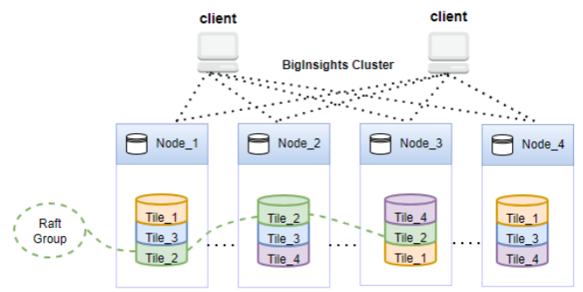

# **向量特性**

## **概述**

向量数据库（Vector Database）在构建基于大语言模型LLM的行业智能应用中扮演着重要角色。向量数据库存储和处理向量数据，提供高效的相似度检索功能。通过向量嵌入（Vector Embedding），将企业知识库文档和数据转化为向量表示，并与大模型进行交互，实现专有或私域的垂直行业智能化应用。

Vector是模型之根，是大模型与知识库交互之桥。而向量嵌入（Vector Embedding）是一种AI原生的数据表示方式，适用于各种基于AI的工具和算法。它可以表示非结构化的数据及知识，如文本、图像、音频和视频等。

AiSQL数据库中以向量插件的扩展方式，引入向量数据存储特性。实现高性能的向量检索，具备多维度查询支持并支持多种精确算法、近似算法。

当前版本主要以spann算法支持大数据量的分布式向量数据库功能。

## **架构**

### **产品架构**
本产品架构可分为接入层，计算层，数据引擎层存储层，存储层


接入层：主要支持sql语句的执行，包括DML，DCL，DDL。

计算层：支持不同引擎的算法计算逻辑，包括crud，事务，以及智能引擎的模型管理，机器学习等。

数据引擎层：支持不同引擎的数据编解码，以及驱动发起数据存储到存储层。

存储层：业务数据，包括不同引擎的用户数据：支持行式存储，向量数据存储，列式存储以及可查询压缩的数据的存储等。

### **部署架构**



向量数据存储引擎融合在BigInsights中，其部署架构如上图所示。
BigInsights采用分布式存储和管理数据的方式，确保数据在多个节点之间的均衡分配和负载均衡。向量数据通过BigInsights能够动态地分布到多个节点，按照数据分片 tile 存储方式持久化，并自动调整数据分布，以保持节点间的负载均衡和数据的一致性。
通过数据分片 tile 的分布式存储方式以及raft group的多副本存储机制，能够提高数据的可靠性和容错性，并支持大规模数据集的存储和处理。

## **原理**

向量数据库的原理是使用算法对向量嵌入建立索引和进行查询。这些算法通过哈希、量化或基于图表的搜索来实现近似最近邻 (ANN) 搜索。为了检索信息，ANN 搜索会找到查询的最近邻向量。与 KNN 搜索（已知最近邻，或真正的 k 最近邻算法）相比，ANN近似最近邻搜索的计算量较小，准确性也相对偏低，但它适用于高效、大规模地处理高维向量的大型数据集。其处理模型类似于下图所示：


向量数据存储的技术特性，包括以下几个方面：

1.用户通过模型，把媒体，文本，以及图像等业务数据转化为向量数据，存储到AiSQL的系统BigInsights的vectorDB中。

2.数据使用前，即检索前，需要先做向量索引构建，包括数据的分区，索引构建。

3.通过sql 即可高效读写向量数据。

4.支持索引恢复等容灾容错处理。


## **功能列表说明**

### **向量数据类型**
1.向量数据引擎提供了 vector 数据类型用于存储向量数据。

2.向量维度可以自定义：系统支持2-16000维度的向量数据，并能够处理多种类型的向量数据，如文本向量、图像向量、音频向量等。

### **向量操作**
支持基本的向量运算，例如加法、减法、点积等。

### **相似性搜索**
支持多种相似性度量算法，包括欧氏距离、余弦相似度、内积。

### **索引**
支持使用 spann 索引加速相似性检索。

### **数据管理**
1.支持水平扩展，可以将数据分区到多个节点，支持大规模向量数据存储与管理。
2.数据被水平划分成多个分片，分布在集群中的不同节点上。
3.支持数据复制和一致性，多副本保证数据可靠性。
4.节点故障时能够自愈式进行故障恢复，保证数据的完整性和高可用性。
5.系统能够自动调整资源分配，实现负载均衡和节点间的数据同步，以确保系统的可伸缩性和高性能。

### **监控和管理**
系统提供丰富的监控和管理功能，帮助用户实时监控系统的状态，并进行故障诊断和性能优化。
用户可以通过系统提供的监控界面查看系统节点的状态信息和日志记录，及时发现并解决系统的问题。同时，系统还提供管理工具和接口，方便管理员对系统进行配置和管理，包括节点管理、数据管理和权限管理等功能。
示例：[http://192.168.50.xx:10000](http://192.168.50.xx:7000)


## **详细功能说明**

### **向量特性简介**
在计算机科学和数据分析领域，向量常用于表示特征、样本或者其他类型的数据。如 图像特征向量、文本特征向量、数值特征向量等。
而在数据库中，数据类型 vector 通常用于存储和处理向量数据。向量是一种数学上的数据结构，表示为浮点数数组。该数据类型允许存储任意维度的向量，但同一列中的所有向量必须具有相同的维度。向量由一组有序的数值组成，在数据库中以浮点数数组的字符串形式进行保存，例如：[0.6798412,0.91988415,0.55674654]。

### **向量基本读写操作**
使用前，需要先扩展vector，启用扩展 (任意节点执行) 的sql语句如下：
```
CREATE EXTENSION vector;
```

扩展了vector以后，向量数据存储前，需要先创建一个带有向量列的新表：
```
CREATE TABLE items (id bigserial PRIMARY KEY, embedding vector(3));
```

或者向现有表添加向量列：
```
ALTER TABLE items ADD COLUMN embedding vector(3);
```

有了向量数据表或向量数据列以后，则可执行插入向量数据：
```
INSERT INTO items (embedding) VALUES ('[1,2,3]'), ('[4,5,6]');
```

或更新插入向量数据：
```
INSERT INTO items (id, embedding) VALUES (1, '[1,2,3]'), (2, '[4,5,6]')  
    ON CONFLICT (id) DO UPDATE SET embedding = EXCLUDED.embedding;
```

更新向量：
```
UPDATE items SET embedding = '[1,2,3]' WHERE id = 1;
```

删除向量：
```
DELETE FROM items WHERE id = 1;
```

支持基本的向量运算，例如加法、减法等运算。 例如：
```
SELECT embedding + '[4,5,6]' FROM items;
```

### **相似性检索**
#### **检索参数**
| 参数名 | 详细描述 | 默认值 |
| --- | --- | --- |
| spann.max_limit | 搜索结果的最大限制。 | 1000 |
| spann.probes | 在进行搜索时使用的探测数目。 | 32 |
| spann.search_machine | 指定用于执行搜索的机器数量 | 10000 |

使用show可以查看参数值
```
SHOW SPANN.max_limit;
```

使用SET设置变量值，只在当前会话有效
```
SET SPANN.max_limit = 64;
```

#### **检索**
L2 距离排序检索
```
SELECT * FROM items ORDER BY embedding <-> '[3,1,2]' LIMIT 5;
```

余弦距离排序检索
```
SELECT * FROM items ORDER BY embedding <=> '[3,1,2]' LIMIT 5;
```

内积距离排序检索
```
SELECT * FROM items ORDER BY embedding <#> '[3,1,2]' LIMIT 5;
```

获取一行中最近的邻居：
```
SELECT * FROM items WHERE id != 1 ORDER BY embedding <-> (SELECT embedding FROM items WHERE id = 1) LIMIT 5;
```

通过L2算法，可获取一定距离内的行：
```
SELECT * FROM items WHERE embedding <-> '[3,1,2]' < 5;
```

注意：与ORDER BY和结合LIMIT结合使用索引

#### **不同距离算法**
获取距离
```
SELECT embedding <-> '[3,1,2]' AS distance FROM items;
```

对于内积，乘以 -1（因为<#>返回负内积）
```
SELECT (embedding <#> '[3,1,2]') * -1 AS inner_product FROM items;
```

对于余弦相似度，使用 1 - 余弦距离
```
SELECT 1 - (embedding <=> '[3,1,2]') AS cosine_similarity FROM items;
```

#### **聚合**
平均向量
```
SELECT AVG(embedding) FROM items;
```

平均向量组
```
SELECT category_id, AVG(embedding) FROM items GROUP BY category_id;
```

### **向量索引**
无索引情况下，向量数据存储引擎执行精确的最近邻搜索，从而提供完美的召回率。
可以通过添加spann索引，以使用近似最近邻搜索，这会牺牲一些召回率来换取速度。与典型索引不同，添加近似索引后，将看到不同的查询结果。
当前向量特性，支持2-4096向量维度的索引。使用以下sql语句构建索引：
```
CREATE INDEX index_name ON table_name USING index_type (vector_column) with (create_index_param);
```

create index 语句说明：
index_name：索引的名称，可以自定义。
table_name：包含向量列的表名。
index_type：索引类型，例如 spann索引等，根据向量数据存储引擎支持算法，选择合适的类型。
vector_column：要创建索引的向量列名称。
create_index_param: 与索引创建有关的索引参数。主要参数有machine，threads，assign。

创建索引示例： 
```
CREATE INDEX ON items USING spann (embedding vector_l2_ops) WITH (machine = 3, threads = 16,assign=1);
```

参数详情说明：
USING spann：指定 spann 索引算法
machine - 数据分布存储的集群节点数(默认所有机器数)，确保数据均衡分区，分配到不同节点上。
threads - 构建索引中的线程数 (默认值为CPU核心数)
assign - 将簇边界上的向量分配给多个簇，增加值可以提升召回率 (默认值为1，不能超过machine数量) 

#### **创建索引示例**
L2 距离
```
CREATE INDEX ON items USING spann (embedding vector_l2_ops);
```

点内积
```
CREATE INDEX ON items USING spann (embedding vector_ip_ops);
```

余弦距离
```
CREATE INDEX ON items USING spann (embedding vector_cosine_ops);
```

### **where过滤**
有几种方法可以使用子句对最近邻居查询进行WHERE过滤
```
SELECT * FROM items WHERE category_id = 123 ORDER BY embedding <-> '[3,1,2]' LIMIT 5;
```

创建一个简单的索引，用于加速在 items 表中根据 category_id 列进行查询。
```
CREATE INDEX ON items (category_id);
```

创建一个向量索引，使用了 spann 索引类型，条件是 (category_id = 123)
```
CREATE INDEX ON items USING spann (embedding vector_l2_ops) WHERE (category_id = 123);
```

创建表，按照 category_id 列的值进行分区
```
CREATE TABLE items (embedding vector(3), category_id int) PARTITION BY LIST(category_id);
```

### **性能分析**
用于EXPLAIN ANALYZE调试性能。
```
EXPLAIN ANALYZE SELECT * FROM items ORDER BY embedding <-> '[3,1,2]' LIMIT 5;
```

### **高频问题**
我可以将不同维度的向量存储在同一列中吗？
可以使用vector 类型（而不是vector(3)）。
```
CREATE TABLE embeddings (model_id bigint, item_id bigint, embedding vector, PRIMARY KEY (model_id, item_id));
```

但是要记住不能进行索引的构建。


## **非功能介绍**

### **典型错误处理**
### **性能情况**
### **安全性和数据保护**
### **用户界面和易用性**
### **兼容性和可扩展性**


## **限制和假设**

### **硬件和软件要求说**
**硬件要求**： 数据库服务器
- 处理器：16核及以上处理器  
- 内存：32G及以上RAM  
- 存储：500GB及以上SSD

**硬件限制：** 
cpu：使用intel处理器并且其支持avx512指令集类型，在处理更大规模的数据能够提供更高级别的性能

### **使用条件**
1.进行1000w及以上向量数据，1024维度的向量索引构建，建议使用64G及以上的内存容量
2.创建索引条件：向量数据 >= machine * 1000
3.集群任意节点的磁盘占用情况>90%，将限制创建索引的操作。
4.创建索引时会预估数据的大小，如果内存不足，将限制创建索引


## **参考**

### **向量操作符**
| 操作符 | 描述 |
| --- | --- |
| + | 逐元素加法 |
| - | 逐元素减法 |
| * | 逐元素乘法 |
| <-> | 欧氏距离 |
| <#> | 负内积 |
| <=> | 余弦距离 |

### **聚合函数**


| 功能 | 描述 |
| --- | --- |
| avg(vector) → vector | 向量平均值 |
| sum(vector) → vector | 向量和 |

### **相似性度量**
在度量向量相似性时，相似性指标发挥着关键作用。选择恰当的度量指标可以极大地提升分类与聚类的效果。
目前，AiSQL的向量数据存储引擎 提供三种主流的相似性指标：欧氏距离（L2）、内积（IP）和余弦相似度（COSINE）。

#### **欧氏距离（L2）**
欧氏距离主要是用来计算连接两点的线段的实际长度。
其计算公式如下：


其中，a = (a0, a1,..., an-1) 和 b = (b0, b1,..., bn-1) 表示 n 维欧氏空间中的两个点。
L2 是最普遍的距离度量方法，在处理连续性数据时尤为有效。

#### **内积（IP）**
两个 Embedding 向量间的 IP 距离可按以下方式定义:
欧氏距离主要是用来计算连接两点的线段的实际长度。
其计算公式如下：


当处理未归一化的数据或关注数据的大小和方向时，内积尤为重要。
例如，Embedding 向量 X 归一化为 X'：


两个 Embedding 向量间的关联度如下所示：


#### **余弦相似度（COSINE）**
余弦相似度是通过计算两组向量之间的夹角余弦来衡量它们的相似度。可以把这两组向量想象为从同一起点（如 [0,0,...]）出发，但朝向不同的线段。
计算两组向量 A = (a0, a1,..., an-1) 和 B = (b0, b1,..., bn-1) 之间的余弦相似度，可使用以下公式：


余弦相似度的值总是介于 [-1, 1] 之间。比如，两个向量的夹角越接近 0 度，余弦相似度越接近 1；两个向量的夹角为 90 度时，其相似度为 0；两个向量的夹角越接近 180 度，两个向量相似度越接近 -1。余弦值越大，表示两向量之间的夹角越小，意味着它们越相似。

通过 1 减去两向量间的余弦相似度，可以得到它们之间的余弦距离。

### **召回率、准确率**
#### **召回率**
召回率是用于评估向量索引性能的重要指标，尤其在近似最近邻（ANN）相似检索中。在ANN中，通过索引结构可以快速地找到一组近似于查询向量的候选项，但可能会错过一些真实的最近邻向量。因此，召回率衡量了检索到的最近邻向量中有多少是与查询向量真实最近邻相匹配的比例。
1.构建索引结构： 使用训练集中的向量数据构建索引结构，以便快速检索近似最近邻。
2.选择测试集： 从整个向量数据集中随机选择一部分样本作为测试集，用于评估索引性能。
3.查询最近邻： 对于测试集中的每个向量，使用索引结构检索其近似最近邻，通常为其top K个近邻向量。
4.计算召回率： 将检索到的近似最近邻向量与测试集中的真实最近邻向量进行比对，计算检索到的真实最近邻的比例。召回率等于检索到的真实最近邻的数量除以测试集的总样本数量。

#### **准确率**
准确率是一个需要人为标注数据的值。（与模型训练有关，与数据库索引性能关系不大）
我们近似检索出来100条，有8条在近邻集10个条目当中，我们通过人为判断这8条中有只有4条是真实相关的向量，那么准确率为4/8。(也就是说近邻集中的10个数据，不一定就是真实相似的向量，比如不都是手机这个种类)。

#### **assign值与簇**
边界上的向量可能会因为距离最近的簇不确定而导致检索结果不准确。为了解决这个问题，spann索引提出了一种多重簇分配方案。
这种方案是将边界上的向量分配给多个最近的簇，而不仅仅是分配给一个最近的簇。这样做的好处是提高了边界向量被正确检索到的概率，因为它们可以被任何最近的簇的索引所搜索到。
assign的值决定了将边界向量分配给多少个最近的簇。增加 assign 的值可以增加向量被索引到的簇的数量，从而可能提高检索的准确性和召回率。然而，这也会增加索引的大小和检索的成本。