## **概述**
大多数组织选择单一的云提供商（或私有数据中心）来部署其应用程序。但这可能会导致供应商锁定，云提供商的功能集和增长可能会成为增长的瓶颈。 
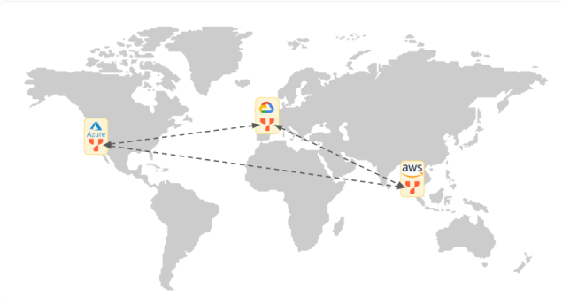

### **多云需求**
采用多云策略的主要目标是为您提供针对每个特定工作负载使用最佳计算环境的灵活性。多云策略有多种好处，包括以下方面：
* 避免供应商锁定。摆脱依赖单一提供商的限制，获得在任何地方构建基础设施的自由。
* 特定于应用程序的优化。根据应用程序的需求与不同云的特定功能和特性对齐。您可以考虑速度、性能、可靠性、地理位置、安全性和合规性等因素，从而调整您的云环境以最适合您的独特需求。
* 将成本降至最低。通过利用各种云提供商提供的最佳定价和性能组合的优势来降低成本。
* 高可用性。一个云提供商的中断不一定意味着应用程序中断，因为流量可以无缝重定向到另一个准备好的云，从而确保不间断的操作。
* 更接近用户。并非所有云提供商的数据中心都靠近不同地区的用户。通过从不同的云提供商中选择数据中心，您可以为所有用户提供更好的体验。
* 数据合规性。当地数据保护法要求公民数据存储在本国。如果一个云提供商在您需要的地区没有数据中心，另一个提供商可能会有。
* 灵活性。如果您无法在特定的地理位置使用当前的云提供商，那么准备好多云会使切换到另一个提供商变得更简单。 
### **构建多云应用程序**
虽然多云方法提供了许多优势，但管理复杂性的提高以及跨多个云实现一致性的性能和可靠性带来了巨大挑战。
AiSQL旨在应对这些挑战。多云管理功能已直接集成到AiSQL、AiSQL Anywhere和AiSQL Managed中。此集成提供了数据库在所有云环境中的全面可见性，使您能够监控成本和使用情况，实施一致性的安全控制和策略，并无缝管理工作负载。

设置：要了解如何在不同的云上设置AiSQL，请参阅[多云设置](#_多云设置)。

部署：设置好多云后，您需要根据可用性和数据访问需求，为应用程序选择合适的设计模式。有关更多详细信息，请参阅[全局应用程序](#_构建全局应用程序)。

### **混合云**
从私有数据中心到公共云不是瞬时的，这需要花费大量的时间和计划。第一步是将一些选定的应用程序移动到公共云，同时将其余应用程序保留在私有数据中心。 
这种混合方法在现代设施设置中越来越普遍。在云迁移过程中，经常采用混合云实现，以逐步、有条理地转换其应用程序和数据。混合云环境能够继续使用本地服务，同时利用公共云提供商提供的灵活数据存储和应用程序访问选项的优点。 
要了解如何在混合云环境中设置AiSQL，请参阅[混合云](#_混合云_1)。

### **云间迁移**
根据您的应用程序或组织的需要，您可能希望从一个云提供商迁移到另一个，或者从本地数据中心迁移到公共云。考虑到不同云提供商之间的差异，这可能是一项艰巨的任务。
AiSQL提供了基本的模式来实现无缝迁移。您可以设置两个独立的Universe，并从旧的数据中心复制到新的数据中心。或者，您可以在所有数据中心中设置全局数据库，然后使用数据放置策略将数据库配置为仅使用特定的数据中心。有关更多详细信息，请参见[多云迁移](#_多云迁移)。 

## **多云设置**
您可以创建一个跨越多个地理区域和云提供商的多云AiSQL universe，以下部分描述了如何使用bm-ctl或AiSQL Anywhere中的传统提供商来设置多云universe。 

### **拓扑结构**
例如，您可以在AWS（us-west）、GCP（us-central）和Azure（us-east）之间建立一个6节点的universe ，复制因子为5。 
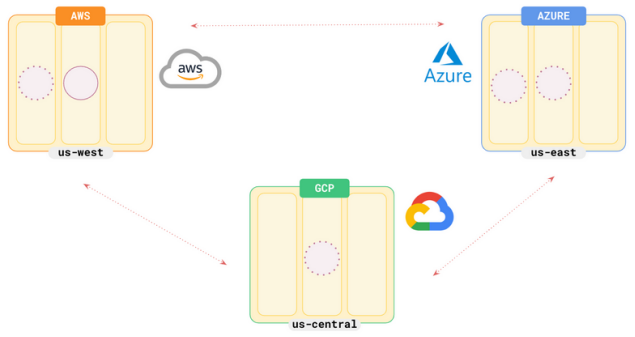VPC对等：尽管在当前示例中，您不必设置VPC 对等，但为了使不同的云能够相互通信，您需要通过VPN隧道设置多云VPC 对等。详细信息请参见设置VPC对等。 

### **设置多云universe**
例如，在AWS、GCP和Azure中设置一个6节点的universe，每个universe有2个节点。

1. 第一个云- AWS
如果本地universe当前正在运行，请首先将其销毁。
首先，创建单个节点，如下所示： 

```
./bin/bm-ctl start \
                --advertise_address=127.0.0.1 \
                --base_dir=/tmp/ydb-aws-1 \
                --cloud_location=aws.us-west-2.us-west-2a;
```

在macOS上，额外的节点需要配置环回地址，如下所示：

```
sudo ifconfig lo0 alias 127.0.0.2
```

如下开启第二个节点：

```
./bin/bm-ctl start \
                --advertise_address=127.0.0.2 \
                --base_dir=/tmp/ydb-aws-2 \
                --cloud_location=aws.us-west-2.us-west-2a \
                --join=127.0.0.1
```

2. 第二个云 - GCP

在macOS上，节点需要配置环回地址，如下所示：

```
sudo ifconfig lo0 alias 127.0.0.3
sudo ifconfig lo0 alias 127.0.0.4
```

按如下方式启动第一个节点：

```
./bin/bm-ctl start \
                --advertise_address=127.0.0.3 \
                --base_dir=/tmp/ydb-gcp-1 \
                --cloud_location=gcp.us-central-1.us-central-1a \
                --join=127.0.0.1
```

按如下方式启动第二个节点：

```
./bin/bm-ctl start \
                --advertise_address=127.0.0.4 \
                --base_dir=/tmp/ydb-gcp-2 \
                --cloud_location=gcp.us-central-1.us-central-1a \
                --join=127.0.0.1
```

3. 第三个云 - Azure
在macOS上，节点需要配置环回地址，如下所示：

```
sudo ifconfig lo0 alias 127.0.0.5
sudo ifconfig lo0 alias 127.0.0.6
```

按如下方式启动第一个节点：

```
./bin/bm-ctl start \
                --advertise_address=127.0.0.5 \
                --base_dir=/tmp/ydb-azu-1 \
                --cloud_location=azu.us-east-1.us-east-1a \
                --join=127.0.0.1
```

按如下方式启动第二个节点：

```
./bin/bm-ctl start \
                --advertise_address=127.0.0.6 \
                --base_dir=/tmp/ydb-azu-2 \
                --cloud_location=azu.us-east-1.us-east-1a \
                --join=127.0.0.1
```

在所有节点上启动bm-ctl进程后，配置universe的数据放置约束，如下所示： 

```
./bin/bm-ctl configure data_placement --base_dir=/tmp/ydb-azu-1 --fault_tolerance=zone --rf 5
```

这个命令可以在任何已经启动AiSQL的节点上执行。

要检查正在运行的多节点universe的状态，请运行以下命令：

```
./bin/bm-ctl status --base_dir=/tmp/ydb-azu-1
```

您应该有一个6节点集群，每个云提供商中有2个节点，如下所示： 

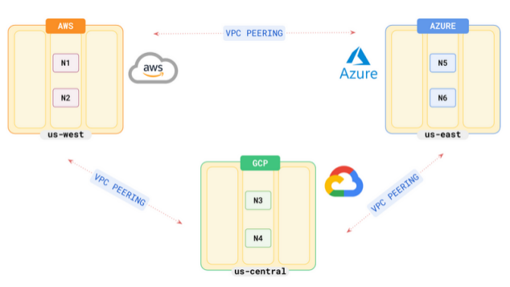
### **多云应用**
场景：假设您有执行交易的零售应用程序，并希望将其部署在离east和west地区的用户更近的地方。这两个应用程序都需要欺诈检测，需要速度快。
部署：您可以从全局应用程序的设计模式列表中进行选择，以便使用以下设置设计您的多云应用程序。
当您希望您的零售应用程序更接近用户时，您可以将它们部署在AWS（us-west）和AZU（us-east）的数据中心。由于这两个系统都需要快速的欺诈检测，而且各地区相距甚远，您可以选择在GCP上部署欺诈检测基础设施，如下所示：

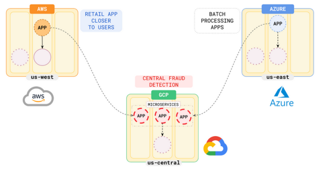
### **混合云**
您还可以使用私有数据中心和公共云的组合来部署应用程序。例如，您可以在传统提供商上处理数据中心部署零售应用程序，在公共云中部署欺诈检测系统。有关更多信息，请参阅[混合云](#_混合云_2)。 

### **故障转移**
在区域故障时，根据您为设置选择的应用程序设计模式，多云AiSQL universe 将自动故障转移到其余任何一个云区域。在上面的示例中，如果您将首选区域的顺序设置为aws:1 azu:2，那么当aws失败时，应用程序将移动到azu，并且应用程序将使用us-east的数据为用户提供服务，而不会丢失任何数据。 

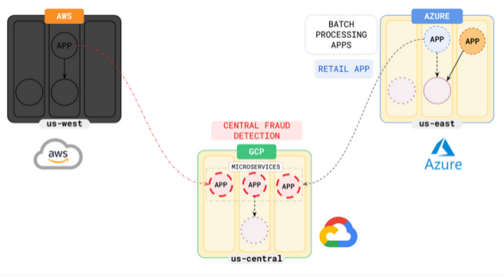
您可以选择距离较近的区域，以避免故障切换延迟的增加。


## **多云迁移**
在不同的云之间迁移数据。

将应用程序从传统的数据中心移动到公共云，或从一个公共云移动到另一个，是一项不简单的任务。AiSQL 为您提供了一个简单的模式，可以相对轻松地完成这项任务

### **两个云间迁移**
为了进行说明，请考虑一个场景，其中您在AWS（us-west）部署了一个3节点集群，并希望迁移到GCP（us-central）。
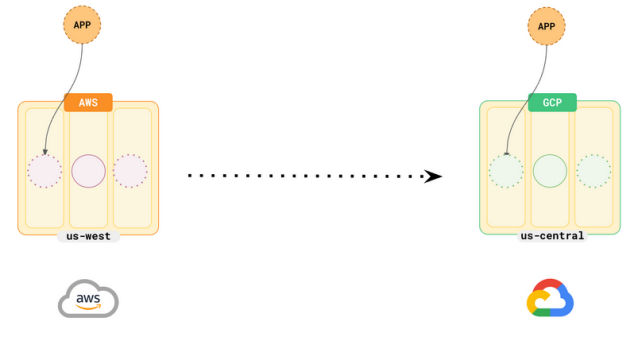要完成迁移，请使用xDCR功能，该功能提供从一个universe 到另一个universe 的单向异步复制。在这种情况下，AWS将是来源，GCP宇宙将是目标。

1. 设置universe 
使用以下设置程序在AWS中设置源universe，在GCP中设置目标universe 
完成后，记下源宇宙和目标universes的universe-uuids

2. 引导新universe 
GCP universe设置完成后，您需要从AWS universe填充数据。这个过程通常被称为引导。


基本引导流程如下：
A. 为AWS领域中的所有表创建一个检查点。例如：

```
./bin/bm-admin -master_addresses <AWS_universe_master_addresses> \
        bootstrap_cdc_producer <comma_separated_source_universe_table_ids>
```

B. 对AWS universe 上的表进行备份，并将它们恢复到GCP universe 中。

这确保了AWS universe 中的当前数据被正确复制到GCP universe 

3. 建立复制
在您的数据从AWS universe 预填充到GCP universe 后，您需要设置从AWS到GCP universe 的复制流。
设置复制的简单方法如下：

```
./bin/bm-admin -master_addresses <GCP_universe_master_addresses> setup_universe_replication \
  <AWS_universe_uuid>_<replication_stream_name> <AWS_universe_master_addresses> \
  <comma_separated_source_universe_table_ids> <comma_separated_bootstrap_ids>
```
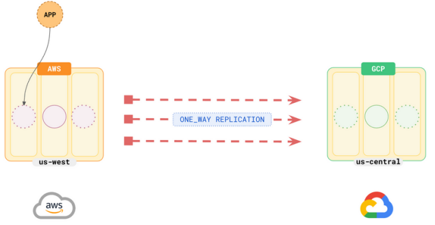对AWS universe 的任何数据更改都会自动应用于GCP universe 。注意：对于此示例，DDL更改必须手动应用。

4. 切换到新的universe 
在新universe赶上旧universe的数据后，你可以切换到新的universe。
切换的基本流程如下：
* 使用基本技术验证数据是否已成功迁移，例如验证两个Universe中对应表的行数是否相同（例如SELECT count（*））。
* 停止到旧universe的应用程序访问，以确保不再尝试更改数据。
* 暂停在新universe上的复制。
* 将GCP universe 提升为ACTIVE。例如：

```
./bin/bm-admin \
    -master_addresses <GCP_master_addresses> \
    -certs_dir_name <cert_dir> \
    change_xDCR_role ACTIVE
```

您可以将应用程序指向GCP中的新universe ，然后停止复制。
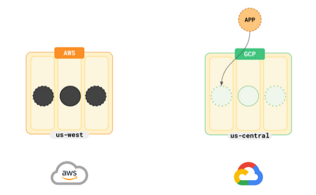在这一点上，您可以拆除您的AWS universe，也可以将其转换为备用集群进行灾难恢复，方法是设置从新的GCP universe 到AWS universe 的xDCR复制

### **从传统数据中心迁移**
您可以使用相同的过程将数据从传统的数据中心迁移到公共云。在完全迁移到公共云之前，您可能需要考虑混合云。有关更多详细信息，请参阅[混合云](#_混合云_2)

 

## **混合云**
许多在数字化现代化之旅中的第一步是将一些应用程序转移到公共云，同时仍在私人数据中心运行许多应用程序。公共云和私有数据中心的混合云环境的这种设置通常被称为混合云。
在云迁移过程中，经常采用混合云实现，以逐步、有条理地转换其应用程序和数据。混合云环境能够继续使用传统服务，同时利用公共云提供商提供的灵活数据存储和应用程序访问选项的优点。
下图显示了一个基本的混合云，包括两个传统数据中心和一个公共云。
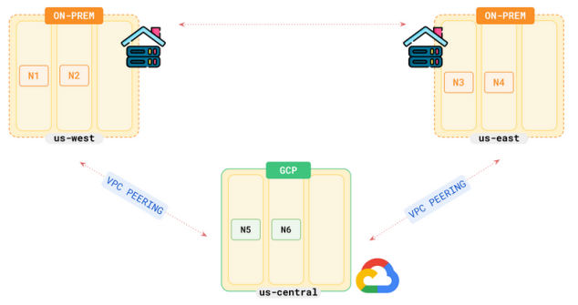
### **混合云的优点**

混合云方法非常适合利用公共云提供的可扩展性和存在性，同时将数据保留在本地以遵守数据监管法律。以下是采用混合云的几个关键好处：
* 逐步现代化：使用混合云，您可以灵活地以自己喜欢的速度将应用程序迁移到云，使您能够随着时间的推移逐步实现技术基础设施的现代化。
* 法规遵从性：许多行业都有关于应用程序和数据的操作位置的特定法规。混合云环境使您能够在遵守法规要求的同时使用私有云和公共云。
* 遗留应用程序支持：您可能有难以迁移到云的遗留系统。混合云允许您通过将应用程序保留在本地来适应这些系统。
* 边缘计算能力：零售或电信等行业通常需要低延迟的边缘计算，例如在信息亭或网络边缘位置运行应用程序。使用混合方法，您可以在边缘运行选定的应用程序，以满足这些特定需求。
* 最新技术：混合云模型提供了利用人工智能和机器学习等尖端技术的机会，而无需扩展或更换当前的基础设施。
通过采用混合云方法，您可以利用公共云和私有云的优势，定制您的基础设施以满足法规遵从性、操作限制和对延迟敏感的要求。

### **混合云部署模式**

每一种混合云策略都必须适应您组织的特定需求，同时考虑到工作负载、法规遵从性和可用性。使用以下模式来绘制将应用程序移动到公共云的路径。

对于这个示例，假设您在us-west和us-east有两个数据中心，并且您在GCP的us-central添加了一个区域。
1. 将琐碎的工作负载转移到公共云上
混合云策略的一个关键好处是，您可以将应用程序从本地数据中心缓慢迁移到公共云。这个过程的第一阶段可能是将一些应用程序转移到公共云。例如，假设您有两个本地数据中心，AiSQL部署用于您的生产和测试应用程序，如下所示：

作为数据中心现代化和扩展的一部分，您可以在您没有业务的地区（例如，us-central）选择一家公共云提供商，并将您的测试应用程序转移到该公共云，如下所示：


此举具有多重优势：
* 您可以在不影响生产系统的情况下测试新的公共数据中心。
* 您不需要花费时间和金钱在us-central建立数据中心，而是利用现有的云基础设施来增加您在us-central的影响力。
* 将一个新的公共云添加到您的环境中，并将不太重要的工作负载转移到其中，这为在本地数据中心中运行其他重要工作负载开辟了可能性。 


2. 将资源密集型工作负载转移到公共云上
在测试了添加到基础设施中的新公共云之后，您可以开始将更重要和资源密集型的应用程序（如机器学习逻辑/流处理等）转移到新采用的公共云。 
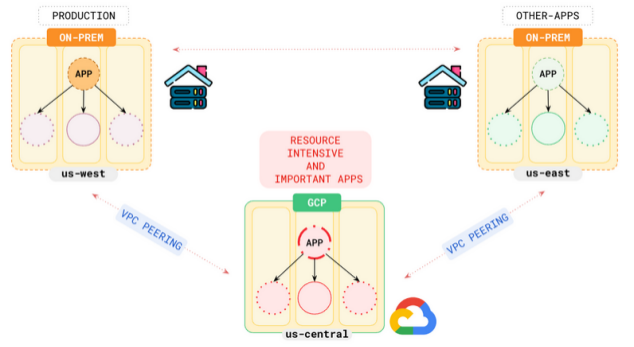将资源密集型应用程序转移到公共云的原因，是更容易切换到公共云提供的强大节点实例。例如，AWS实例类型和GCP实例类型。 

3. 在混合云上传播应用程序
在您对管理新添加的公共云感到满意并对其性能感到满意后，将主数据库分布在本地数据中心和公共云上是一个不错的选择，如下图所示：


通过此设置，您可以获得一个全局数据库，使您的数据在两个本地数据中心和公共云之间保持一致，并允许所有数据中心中运行的所有应用程序访问您的数据。在这种情况下，您可以将本地数据中心设置为首选zone-1，将公共云设置为第二首选区域。


### **故障转移**
由于您已将公共云设置为第二个首选区域，如果us-west的主要本地数据中心失败，位于us-central的GCP地区的分片follower将被提升为leader，您的应用程序可以继续为您的用户服务，而不会有任何数据丢失。 
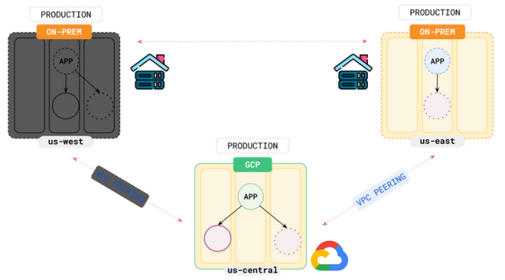