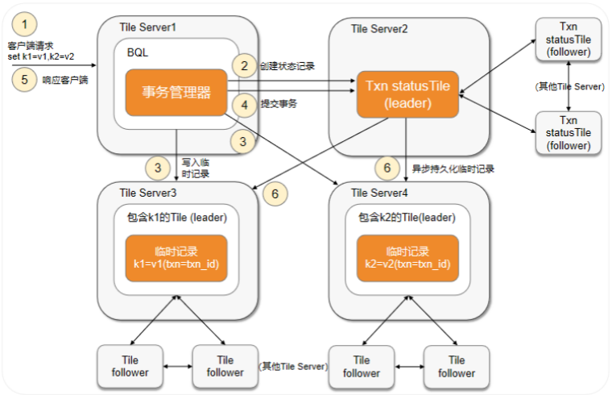
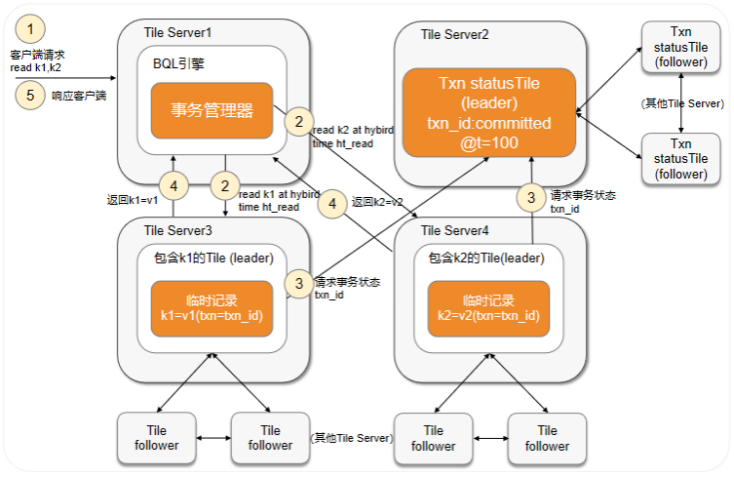

有关 AiSQL 分布式事务实现中使用的常见概念的概述，请参阅分布式事务。

事务的写入路径用于修改多个键，读取路径用于从多个Tile读取一致的值组合。

## **写入路径**

写入路径可以通过单个分布式只写事务的生命周期来演示。 假设需要修改键为k1和k2的行。 如果它们属于同一片，则事务可以作为单分片事务执行，在这种情况下，两个更新将作为同一 Raft 日志记录的一部分进行复制，从而确保原子性。 然而，在最一般的情况下，这些键将属于不同的Tile，这是工作假设。

下图描述了分布式只写事务的高级步骤，不包括任何冲突解决：



**1.客户请求事务**
客户端向 AiSQL Tablet 服务器发送请求，需要分布式事务。 以下示例使用 CQL 的扩展：

```
START TRANSACTION;
UPDATE t1 SET v = 'v1' WHERE k = 'k1';
UPDATE t2 SET v = 'v2' WHERE k = 'k2';
COMMIT;
```

接收事务写入请求的tablet 服务器负责驱动该事务中涉及的所有步骤。 事务步骤的编排由称为事务管理器的组件执行。 每笔交易都由一个事务管理器处理。

**2.创建事务记录**
分配事务 ID 并选择事务状态Tile来跟踪具有以下字段的事务状态记录：

* 状态可以是待处理、已提交或中止。
* 提交混合时间戳（如果已提交）。
* 参与Tile的 ID 列表（如果已提交）。
  选择事务状态tablet的方式是有意义的，这样事务管理器的tablet服务器也是其Raft组的领导者，因为这可以减少查询和更新事务状态时的RPC延迟。 但在最一般的情况下，事务状态Tile可能不会托管在启动事务的同一Tile服务器上。

**3.写入临时记录**
临时记录被写入包含需要修改的行的Tile。 这些临时记录包含事务ID、需要写入的值以及临时混合时间戳，该临时混合时间戳不是最终提交时间戳，并且通常对于同一事务内的不同临时记录来说是不同的。 相比之下，整个事务只有一个提交混合时间戳。

在写入临时记录时，可能会遇到与其他事务的冲突。 在这种情况下，事务必须中止并重新启动。 这些重新启动对于客户端来说仍然是透明的，直到重试一定次数为止。

**4.提交事务**
当事务管理器写入所有临时记录后，它通过向事务状态Tile发送 RPC 请求来提交事务。 仅当事务尚未因冲突而中止时，提交操作才能成功。 提交操作的原子性和持久性由事务状态tablet的Raft组保证。 一旦提交操作完成，所有临时记录立即对客户端可见。

事务管理器发送到状态tablet的提交请求包括参与事务的所有tablet的tablet ID列表。 此时，无法将新的Tile添加到该组中。 状态Tile需要此信息来协调清理参与Tile中的临时记录。

**5.将响应发送回客户端**
YQL 引擎将响应发送回客户端。 如果任何客户端（相同或不同）发送对已写入键的读取请求，则新值一定会反映在响应中，因为事务已提交。 数据库的这一属性有时称为“读取您自己的写入”保证。

**6.异步应用和清理临时记录**
在收到事务的提交消息并成功将事务状态的更改复制到 Raft 组中后，事务状态 Tablet 会协调此步骤。 事务状态Tile已经知道哪些Til正在参与此事务，因此它会向它们发送清理请求。 每个参与的tablet都会在其Raft日志中记录一个特殊的“apply”记录，其中包含事务ID和提交时间戳。 当该记录在参与的tablet中进行Raft复制时，tablet会删除属于该事务的临时记录，并将具有正确提交时间戳的常规记录写入其RocksDB数据库。 这些记录实际上与常规单行操作写入的记录没有区别。

一旦所有参与的Tile都成功处理了这些应用请求，状态Tile就可以删除事务状态记录，因为尚未清除临时记录的参与Tile的所有副本（例如，慢速追随者）将根据本地可用的信息来执行此操作。 状态记录的删除是通过将特殊的“applied everywhere”条目写入状态Tile的 Raft 日志来实现的。 在此之后不久，作为旧 Raft 日志常规垃圾收集的一部分，属于该事务的 Raft 日志条目将从状态表的 Raft 日志中清除。

## **读取路径**

AiSQL 是一个多版本并发控制 (MVCC) 数据库，这意味着它在内部跟踪同一值的多个版本。 读操作不占用任何锁。 相反，它们依赖 MVCC 时间戳来读取数据的一致快照。 长时间运行的读取操作（无论是单分片还是跨分片）可以与修改同一键的写入操作同时进行。

如单行事务中所述，最新读取是从单个Tile（分片）执行的，键的最新值是 Raft 领导者已知的最后提交的 Raft 日志记录写入的值。 但是，为了从不同的Tile读取多个键，必须确保读取的值来自数据库的最新一致快照。 以下阐明了所选快照的这些属性：
**一致性快照**：快照必须完整地显示任何事务的记录，或者根本不显示它们。 它不能包含事务写入的一半值而忽略另一半。 通过在特定混合时间（ht_read）执行所有读取并忽略具有较晚混合时间的任何记录来确保快照一致性。
**最近的快照**：快照包含任何客户端可能已经看到的任何值，这意味着在启动此读取操作之前写入或读取的所有值。 这还包括客户端应用程序的其他组件可能已写入数据库或从数据库读取的所有先前写入的值。 执行当前读取的客户端可能依赖于结果集中这些值的存在，因为客户端应用程序的那些其他组件可能已通过异步通信通道将此数据传送到当前客户端。 为了保证快照是最近的，当确定选择的混合时间太早时，需要重新启动读操作，即有一些记录在读操作发起之前本来可以写入，但存在混合时间 晚于当前设置的 ht_read。

下图描述了该过程：



**1.处理客户端请求并初始化读事务**
客户端对 BCQL、YEDIS 或 BSQL API 的请求到达 Tablet 服务器的 YQL 引擎。 YQL引擎检测到查询请求来自多个tablet的行并启动只读事务。 为该请求选择混合时间ht_read，该时间可以是YQL引擎的tablet服务器上的当前混合时间，也可以是所涉及的tablet之一上的安全时间。 后一种情况至少会减少该Tile的等待安全时间，因此性能更好。 通常，由于 AiSQL 负载平衡策略，接收请求的 YQL 引擎还托管请求正在读取的一些Tile，从而允许实现性能更高的第二个选项，而无需额外的 RPC 往返。

此外，还会选择一个名为 global_limit 的时间点，计算公式为：physical_time + max_clock_skew，这有助于确定在读取请求开始后是否明确写入了特定记录。 max_clock_skew 是不同 AiSQL 服务器之间时钟偏差的全局配置界限。

**2.在特定混合时间从所有Tile读取**
YQL引擎向所有需要读取事务的tablet发送请求。 根据安全时间的定义，每个tablet等待ht_read成为安全读取时间，然后开始从其本地CoreDB执行其部分读取请求。

当tablet服务器看到具有混合时间ht_record的相关记录时，它会执行以下逻辑：

* 如果 ht_record ≤ ht_read，则将该记录包含在结果中。
* 如果 ht_record >define_future_ht，则从结果中排除该记录。 define_future_ht 表示混合时间，混合时间晚于该时间的记录肯定是在读取请求开始后写入的。 目前，define_future_ht 可以假设为 global_limit。
* 如果ht_read < ht_record ≤define_future_ht，则不知道该记录是在读请求开始之前还是之后写入的。 但不能从结果中省略它，因为如果它实际上是在读取请求之前写入的，则可能会产生客户端观察到的不一致。 因此，整个读取操作必须使用 ht_read = ht_record 的更新值重新启动。

为了防止这些读取重新启动的无限循环，依赖于Tile的混合时间值 local_limit 将返回到 YQL 引擎，计算为该Tile中的当前安全时间。 现在已知，在读取请求开始之前不可能写入混合时间晚于 local_limit 的任何记录（常规或临时）。 因此，如果在稍后尝试在同一事务中读取该tablet时观察到混合时间晚于local_limittablet的记录，则不必重新启动读取事务，并且在future上设置definitely_future_ht = min(global_limit, local_limit) 尝试。

**3.Tile查询事务状态**
当每个参与的tablet从其本地CoreDB读取时，它可能会遇到尚不知道最终事务状态和提交时间的临时记录。 在这些情况下，它将向交易状态Tile发送事务状态请求。 如果提交了事务，则将其视为 CoreDB 已包含混合时间等于事务提交时间的永久记录。 临时记录的清理是独立且异步进行的。

**4.Tile应 YQL**
每个Tile对 YQL 的响应包含以下信息：

* 是否需要读取重启。
* local_limit 用于限制此Tile引起的未来读取重新启动。
* 从此Tile读取的实际值。

**5.YQL 将响应发送给客户端**
一旦来自所有参与Tile的所有读取操作成功并且确定不需要重新启动读取事务，就会使用适当的有线协议将响应发送到客户端。