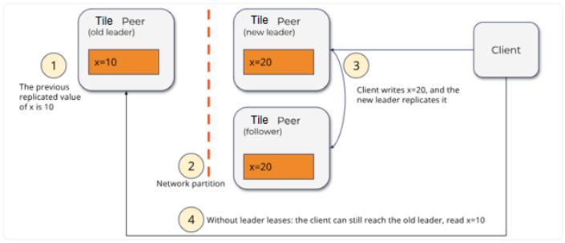

AiSQL 为涉及同一分片（分区、Tile）中的单行或多行的突变提供原子性、一致性、隔离性、持久性 (ACID) 语义。 这些突变仅在分布式共识节点之间产生一次网络往返。

即使是单行或单个分片中的读取-修改-写入操作（如下所示），在 AiSQL 中也只产生一次往返：

```
   UPDATE table SET x = x + 1 WHERE ...
   INSERT ... IF NOT EXISTS
   UPDATE ... IF EXISTS
```

请注意，这与 Apache Cassandra 不同，后者使用称为轻量级事务的概念来实现这些读取-修改-写入操作的正确性，并导致 4 网络往返延迟。

## **Reading the latest data from a recently elected leader**

在稳定状态下，当领导者追加和复制日志条目时，最新的多数复制条目正是已提交的条目。 然而，领导者更换后，情况变得更加复杂。 当Tile中选举出新的领导者时，它会将无操作条目附加到Tile的 Raft 日志中并复制它，如 Raft 协议中所述。 在复制此无操作条目之前，Tile被视为无法读取最新值并接受读取-修改-写入操作。 这是因为新的tablet领导者需要能够保证所有之前Raft提交的条目都应用于RocksDB和其他持久化和内存中的数据结构，并且只有在知道新领导者的所有条目之后才有可能日志已提交。

## **Leader Lease：在网络分区的情况下读取最新数据**

领导者租约是Tile领导者在一定的短时间内建立其权限的一种机制，以避免以下不一致的情况：

* 领导者与其追随者通过网络隔离。

* 选出了新的领导人。

* 客户端写入一个新值，新的领导者复制它。

* 客户端从旧领导者那里读取过时的值。

  

AiSQL中的leader租约机制可以防止这种不一致，如下：

* 对于每个领导者到跟随者的消息（Raft 术语中的 AppendEntries），无论是复制新条目还是空心跳消息，领导者都会以时间间隔形式发送领导者租约请求（例如，“我想要 2 秒的租约”） ）。 租约期限通常是系统范围的参数。 对于每个对等点，领导者还跟踪与每个待处理请求相对应的租约到期时间（例如，发送请求的时间加上租约持续时间），该时间以所谓的本地单调时间（CLOCK_MONOTONIC）存储。 为此，领导者将自己视为同伴的特例。 然后，当领导者收到来自追随者的响应时，它会维护在请求发送时存储的这些过期时间的多数复制水印。 领导者采用这个多数复制水印作为其租约到期时间，并在决定是否可以服务一致的读取请求或接受写入时使用它。
* 当跟随者收到前面描述的 Raft RPC 时，它会读取当前单调时钟的值，将提供的租约间隔添加到该值中，并记住该租约到期时间（也是根据其本地单调时间）。 如果该追随者成为新的领导者，则在任何潜在的旧领导者的租约到期之前，不允许提供一致的读取或接受写入。
* 为了保证任何新领导者都知道任何旧领导者的租约到期，还需要另一位逻辑。 每个 Raft 组成员都会记录它所知道的旧领导者的最新过期时间（以该服务器的本地单调时间为单位）。 每当服务器响应 RequestVote RPC 时，它都会在其响应中包含任何已知旧领导者租约的最大剩余时间。 这与接收服务器上领导者 AppendEntries 请求中的租约期限类似地进行处理：自收到此请求以来，至少必须经过这个时间量，然后接收者才能为最新请求提供服务，以防它成为领导者 。 需要这部分算法，以便可以证明新领导者将始终了解任何旧领导者的多数复制租约。 这类似于Raft的正确性证明：总有一个服务器（投票者）收到旧领导者的租约请求并投票给新领导者，因为两个多数必须重叠。

请注意，此领导者租用实现不依赖于任何类型的时钟同步，因为仅通过网络发送时间间隔，并且每个服务器根据其本地单调时钟进行操作。 以下是时钟实现的两个要求：

* 不同服务器之间的有界单调时钟漂移率。 例如，如果使用每秒漂移率小于 500μs 的标准 Linux 假设，则可以通过将前面提到的所有延迟乘以 1.001 来计算。
* 单调时钟不会冻结。 例如，如果在暂时冻结的虚拟机上运行，则当虚拟机再次开始运行时，管理程序需要从硬件时钟刷新虚拟机的时钟。

Leader 租用机制保证在任何时间点，任何 Tablet 的 Raft 组中最多有一台服务器认为自己是最新的 Leader，可以为一致的读取提供服务或接受写入请求

## **读取请求的安全时间戳分配**

每个读取请求都会分配一个特定的多版本并发控制 (MVCC) 时间戳或混合时间（例如，称为 ht_read），这允许对同一组键的写入操作与读取并行发生。 然而，至关重要的是，截至该时间戳的数据库视图不会因同时发生的写入而更新。 也就是说，一旦为读请求选择了ht_read，就不能为对同一组键的进一步写入分配早于或与ht_read相同的时间戳。 正如已经提到的，严格增加的混合时间被分配给任何给定片的 Raft 日志条目。 因此，安全分配 ht_read 的一种方法是使用最后提交记录的混合时间。 由于提交的 Raft 日志记录永远不会被未来的领导者覆盖，并且每个新的领导者都会读取最后一个日志条目并更新其混合时间，因此所有未来的记录都将具有严格的较晚的混合时间。

但是，通过这种保守的时间戳分配方法，如果此特定Tile上没有写入工作负载，ht_read 可以保持不变。 如果使用生存时间 (TTL)，这会导致客户端观察到的异常：就客户端而言，在新记录写入Tile之前，过期值不会消失。 然后，许多旧的过期值可能会突然消失。 为了防止这种异常情况，需要将读取时间戳指定为接近当前混合时间（反过来又接近物理时间），以保留自然的 TTL 语义。 应尝试选择 ht_read 作为可能的最新时间戳，这样可以保证 table 中所有未来的写入操作都将具有严格晚于该时间的混合时间，即使在领导者更改期间也是如此。

这需要引入混合时间领导者租赁的概念，类似于前面讨论的绝对时间领导者租赁。 对于向关注者发出的每个 Raft AppendEntries 请求，无论是常规请求还是空请求或心跳请求，tablet 领导者都会计算混合时间租约到期时间（例如，称为 ht_lease_exp），并将其发送给关注者。 ht_lease_exp 通常计算为当前混合时间加上固定配置的持续时间（例如，2 秒）。 通过回复，追随者承认旧领导者对分配任何混合时间（包括 ht_lease_exp）的专有权力。 与常规租赁类似，这些混合时间租赁通过投票进行传播。 领导者维护一个多数复制水印，并认为自己已经复制了混合时间领导者租约到期的特定值（如果它向大多数 Raft 组成员发送了该值或更大的 ht_lease_exp 值）。 为此，领导者始终被认为已向自身复制了无限的领导者租约。

**安全时间的定义**
假设当前多数复制混合时间领导者租约到期称为replicated_ht_lease_exp。 然后，读取请求的安全时间戳可以计算为以下最大值：
最后提交的 Raft 条目的混合时间。
以下之一：
如果Raft日志中有未提交的条目，则第一个未提交条目的混合时间的最小值 - ε，其中ε是混合时间和replicated_ht_lease_exp之间的最小可能差异。
如果Raft日志中没有未提交的条目，则当前混合时间和replicated_ht_lease_exp中的最小值。

换句话说，最后提交的条目的混合时间始终可以安全读取，但对于后来的混合时间，多数复制的混合时间领导者租约是上限。 这是因为，只有当 ht<replicated_ht_lease_exp 时，才能保证未来的领导者不会提交混合时间早于 ht 的条目。

请注意，当从单个tablet读取时，无需等待所选的ht_read变得可以安全读取，因为它已经被选择了。 但是，如果决定跨多个Tile读取一致的数据视图，则可以在其中一个Tile上选择 ht_read，并且需要等待该时间戳在第二个Tile上安全读取。 这通常发生得非常快，因为第二个tablet的leader上的混合时间会立即用第一个tablet的leader传播的混合时间更新，并且在常见情况下，需要等待混合时间早于的待处理Raft日志条目 ht_read 被提交。

## **将安全时间从领导者传播到追随者以供追随者端读取**

AiSQL 支持从追随者读取，以满足需要极低读取延迟的用例，而这种延迟只能通过在最靠近客户端的数据中心提供读取请求来实现。 这是以可能稍微陈旧的结果为代价的，这是您必须做出的权衡。 与强一致的领导者端读取类似，追随者端读取操作也必须选择一个安全的读取时间戳。

如前所述，“安全读取时间”意味着未来的写入不应更改截至读取时间戳的数据视图。 然而，只有领导者才能使用前面描述的算法计算安全读取时间。 因此，最新的安全时间通过 AppendEntries RPC 从领导者传播到追随者。 例如，由分区追随者处理的追随者端读取将看到数据的冻结快照，包括指定 TTL 且未超时的值。 当分区修复后，追随者开始接收来自领导者的更新，并可以返回非常接近最新的读取结果。
