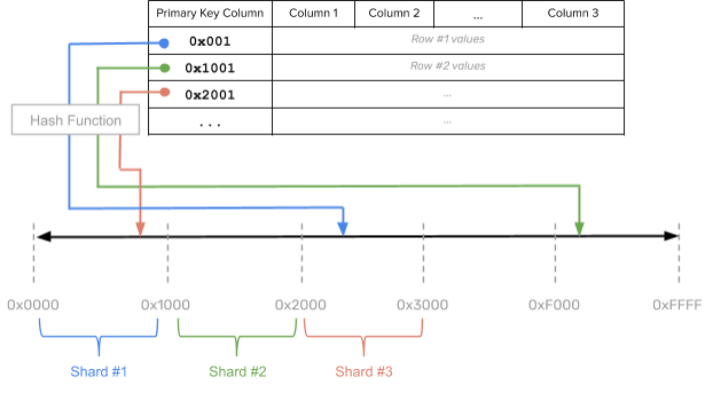

## **概述**

Tile分割是通过在添加数据之前预分割表或在运行时更改Tile数量来对 Universe 中的数据进行重新分片。 目前，AiSQL universe中存在三种压片分裂机制。

**1.范围扫描**
当需要扫描一定范围的数据时，数据按照自然排序顺序存储（也称为范围分片）。 在这种情况下，通常不可能提前预测良好的分割边界。 考虑以下示例：

```
CREATE TABLE census_stats (
    age INTEGER,
    user_id INTEGER,
    ...
    );
```

在这个例子中，提前选择分割点是很困难的。 数据库无法推断表中年龄值的范围（通常在 1 到 100 范围内）。 并且表中行的分布（即为每个age值插入多少user_id行以进行均匀分布的数据分割）是无法预测的。

**2.低基数主键Low-cardinality primary keys**
在主键或辅助索引基数较低的用例中，散列无效。 例如，如果主键或索引是性别列的表，只有两个值（男或女），则哈希分片不会有效。 然而，使用整个机器集群来最大化服务吞吐量非常重要。

**3.小表逐渐变成大表Small tables that become very large**
有些表一开始就很小，只有几个分片。 如果这些表变得非常大，节点就会不断添加到 Universe 中。 有可能节点数量超过tablet数量。 为了有效地重新平衡集群，需要进行tablet分割。

## **Tile分裂的方法**

CoreDB 允许使用以下三种机制通过拆分 Tablet 来重新分片：

* 预分割tablet：在CoreDB中创建的所有表都可以在创建时分割成所需数量的tablet。
* 手动拆分tablet：运行中的集群中的tablet可以由您在运行时手动拆分。
* 自动tablet分割：正在运行的集群中的tablet会由数据库根据某种策略自动分割。

**1.预裂片Presplitting tablets**
在创建时，您可以将表预先拆分为所需数量的Tile。 AiSQL支持范围分片和散列分片BSQL表以及散列分片BCQL表的预分割片。 可以通过以下两种方式之一指定Tile的数量：

* Desired number of tablets, when the table is created with the desired number of tablets.

* Desired number of tablets per node, when the total number of tablets the table is split into is computed as follows:

num_tablets_in_table = num_tablets_per_node * num_nodes_at_table_creation_time

要将表预分割为所需数量的Tile，您需要每个Tile的开始键和结束键。 这使得哈希分片和范围分片表的预分割略有不同。

**（1）哈希分片表**
由于哈希分片的工作原理是在主键列的全部或子集上应用哈希函数，因此哈希分片键的字节空间是提前已知的。 例如，如果您使用 2 字节哈希，则字节空间将为 [0x0000, 0xFFFF]，如下图所示：



在上图中，BSQL 表被分为 16 个分片。 这可以通过使用 SPLIT INTO 16 TABLETS 子句作为 CREATE TABLE 语句的一部分来实现，如下所示：

```
CREATE TABLE customers (
    customer_id bpchar NOT NULL,
    company_name character varying(40) NOT NULL,
    contact_name character varying(30),
    contact_title character varying(30),
    address character varying(60),
    city character varying(15),
    region character varying(15),
    postal_code character varying(10),
    country character varying(15),
    phone character varying(24),
    fax character varying(24),
    PRIMARY KEY (customer_id HASH)
) SPLIT INTO 16 TABLETS;
```

有关相关 BSQL API 的信息，请参阅以下内容：

CREATE TABLE ... SPLIT INTO 和示例，Create a table specifying the number of tablets。
CREATE INDEX ... SPLIT INTO 和示例， Create an index specifying the number of tablets。
有关相关 BCQL API 的信息，请参阅以下内容：

CREATE TABLE ...WITH tablets和示例，Create a table specifying the number of tablets。

**（2）范围分片表**
在范围分片的 BSQL 表中，每个片的开始键和结束键无法立即得知，因为这取决于列类型和预期用途。 例如，如果主键是百分比 NUMBER 列，其中值的范围在 [0, 100] 范围内，则对整个 NUMBER 空间进行预分割将不会有效。

因此，为了预分割范围分片表，您必须显式指定分割点，如下例所示：

```
CREATE TABLE customers (
    customer_id bpchar NOT NULL,
    company_name character varying(40) NOT NULL,
    contact_name character varying(30),
    contact_title character varying(30),
    address character varying(60),
    city character varying(15),
    region character varying(15),
    postal_code character varying(10),
    country character varying(15),
    phone character varying(24),
    fax character varying(24),
    PRIMARY KEY (customer_id ASC)
) SPLIT AT VALUES ((1000), (2000), (3000), ... );
```

有关相关 BSQL API 的信息，请参阅 CREATE TABLE ... SPLIT AT VALUES 以与范围分片表一起使用

**2.手动Tile分割**
假设有一个表，其中预先存在的数据分布在一定数量的Tile上。 可以手动拆分此表中的部分或全部Tile。

请注意，误用或过度使用手动Tile拆分（例如，拆分流量较少的Tile）可能会导致创建大量不同大小和流量速率的Tile。 这无法轻易解决，因为当前不支持Tile合并.

**（1）创建示例 BSQL 表**
创建一个三节点本地集群，如下：

```
./bin/bm-dev-ctl --rf=3 create --bsql_num_shards_per_dbserver=1
```

创建一个示例表并插入一些数据，如下：

```
CREATE TABLE t (k VARCHAR, v TEXT, PRIMARY KEY (k)) SPLIT INTO 1 TABLETS;
```

在此表中插入一些示例数据（100000 行），如下所示：

```
INSERT INTO t (k, v)
    SELECT i::text, left(md5(random()::text), 4)
    FROM generate_series(1, 100000)  s(i);
SELECT count(*) FROM t;
```

输出如下：

```
count
--------
100000
(1 row)
```

**（2）验证表只有一个Tile**
要验证表 t 是否只有一个tablet，请使用以下 bm-admin list_tablets 命令列出表 t 的所有tablet：

```
./bin/bm-admin --mserver_addresses 127.0.0.1:11000 list_tablets bsql.bigmath t
```

预期输出如下：

```
Tablet UUID                       Range                         Leader
9991368c4b85456988303cd65a3c6503  key_start: "" key_end: ""     127.0.0.1:21000
```

记下Tile UUID 以供以后使用。

**（3）手动刷新tablet**
Tile应该在磁盘上保留一些数据。 如果插入少量数据，它仍然只能存在于内存缓冲区中。 为了确保磁盘上存在 SST 数据文件，可以通过运行以下 dbserver-ctl 命令手动刷新该表的数据块：

```
./bin/dbserver-ctl \
    --server_address=127.0.0.1:21000,127.0.0.2:21000,127.0.0.3:21000 \
    flush_tablet 9991368c4b85456988303cd65a3c6503
```

**（4）手动拆分Tile**
该表的tablet可以通过运行以下bm-admin split_tablet命令手动拆分为两个tablet：

```
./bin/bm-admin \
    --mserver_addresses 127.0.0.1:11000,127.0.0.2:11000,127.0.0.3:11000 \
    split_tablet 9991368c4b85456988303cd65a3c6503
```

拆分后，您预计会看到表 t 的两个Tile，如以下输出所示：

```
Tablet UUID                       Range                                 Leader
20998f68c3fa4d299e8af7c04410e230  key_start: "" key_end: "\177\377"     127.0.0.1:21000
a89ecb84ad1b488b893b6e7762a6ca2a  key_start: "\177\377" key_end: ""     127.0.0.3:21000
```

原Tile 9991368c4b85456988303cd65a3c6503已不存在； 它已被两个新Tile取代。

Tile领导者现在分布在两个节点上，以便在集群的节点之间均匀平衡表的Tile。

**3.自动Tile分割**
自动数据片分割可以在达到指定大小阈值时自动在线且透明地重新分片集群中的数据。

架构设计详情请参见Tablet拆分数据自动重新分片。

**（1）启用自动Tile分割**
启用自动 Tablet 拆分后，新创建的哈希分片表默认每个节点有一个 Tablet。

另外，从2.14.10版本开始，对于2个CPU核心以下的服务器，新建表每个集群1个tablet，4个CPU核心以下的服务器每个集群2个tablet。

从版本 2.18.0 开始，默认打开自动平板分割。

要控制自动Tile分割，请使用 mserver --enable_automatic_tablet_splitting 标志并指定关联的标志来配置Tile何时应分割，并使用 dbserver --enable_automatic_tablet_splitting。 AiSQL 集群的所有 mserver 和 dbserver 配置上的标志必须匹配。

注：除非在表创建期间显式指定表分区，否则新创建的具有范围分片的表的每个集群始终有一个tablet。

自动数据片分割分三个阶段进行，具体取决于每个节点的分片数量。 随着分片数量的增加，分割tablet的阈值大小也会增加，如下：

**Low phase**
在低阶段，每个节点的分片数少于tablet_split_low_phase_shard_count_per_node（默认为8）。 在此阶段，AiSQL 拆分大于tablet_split_low_phase_size_threshold_bytes（默认为512 MB）的tablet。

High phase
在高阶段，每个节点的分片数少于tablet_split_high_phase_shard_count_per_node（默认为24）。 在此阶段，AiSQL 拆分大于tablet_split_high_phase_size_threshold_bytes（默认为10 GB）的tablet。

Final phase
当分片数量超过高阶段数量（由tablet_split_high_phase_shard_count_per_node确定，默认为24）时，AiSQL会分割大于tablet_force_split_threshold_bytes（默认为100 GB）的片剂。 这将持续下去，直到达到每个表的tablet_split_limit_per_table 片数限制（默认为256 片；如果设置为0，则没有限制）。

**（2）分裂后压实**
一旦在一个tablet上执行了分割，生成的两个tablet就需要完全压缩，以便从每个tablet中删除不必要的数据。 这些分割后压缩会显着增加 CPU 和磁盘使用率，从而影响性能。 为了限制影响，默认情况下允许的同时Tile分割数量是保守的。

如果由于自动数据片分割而导致性能受到影响，可以使用以下标志进行调整：
**MServer 标志：**

* Outstanding_tablet_split_limit 默认将未完成的 Tablet 拆分总数限制为 1。 执行分割后压缩的Tile将计入此限制。
* Outstanding_tablet_split_limit_per_dbserver 默认情况下将每个节点未完成的tablet split 总数限制为1。 执行分割后压缩的Tile将计入此限制。

**bm-dbserver标志：**

* post_split_trigger_compaction_pool_max_threads 表示每个节点专用于分割后压缩任务的线程数。 默认情况下，此值限制为 1。增加此值可能会更快地完成数据块分割，但需要更多的 CPU 和磁盘资源。
* post_split_trigger_compaction_pool_max_queue_size 表示每个节点可以同时排队的未完成的分割后压缩任务的数量，默认限制为 16。

当启用自动tablet分割时，automatic_compaction_extra_priority为较小的压缩提供额外的压缩优先级。 这可以防止较小的压缩因较大的分割后压缩而缺乏资源。 默认情况下设置为 50（建议的最大值），并且可以减少到 0。

**（3）带有自动数据片分割的 YCSB 工作负载示例**
在以下示例中，创建了一个三节点集群并使用 YCSB 工作负载来演示在 BSQL 数据库中使用自动 Tablet 拆分：
创建一个三节点集群，如下：

```
./bin/bm-dev-ctl --rf=3 create --mserver_flags "enable_automatic_tablet_splitting=true,tablet_split_low_phase_size_threshold_bytes=30000000" --dbserver_flags "memstore_size_mb=10"
```

创建工作负载表，如下：

```
./bin/sqlsh -c "CREATE DATABASE ycsb;"
 
./bin/sqlsh -d ycsb -c "CREATE TABLE usertable (
        YCSB_KEY TEXT,
        FIELD0 TEXT, FIELD1 TEXT, FIELD2 TEXT, FIELD3 TEXT,
        FIELD4 TEXT, FIELD5 TEXT, FIELD6 TEXT, FIELD7 TEXT,
        FIELD8 TEXT, FIELD9 TEXT,
        PRIMARY KEY (YCSB_KEY ASC));"
```

在 ~/code/YCSB/db-local.properties 中创建 YCSB 的属性文件并添加以下内容：

```
db.driver=org.postgresql.Driver
db.url=jdbc:postgresql://127.0.0.1:2521/ycsb;jdbc:postgresql://127.0.0.2:2521/ycsb;jdbc:postgresql://127.0.0.3:2521/ycsb
db.user=bigmath
db.passwd=
core_workload_insertion_retry_limit=10
```

开始为工作负载加载数据，如下所示：

```
~/code/YCSB/bin/ycsb load jdbc -s -P ~/code/YCSB/db-local.properties -P ~/code/YCSB/workloads/workloada -p recordcount=500000 -p operationcount=1000000 -p threadcount=4
```

使用 AiSQL Web 界面（http://localhost:10000/tile-servers 和 http://127.0.0.1:20000/tablets）监控Tile拆分。

运行工作负载，如下所示：

```
~/code/YCSB/bin/ycsb run jdbc -s -P ~/code/YCSB/db-local.properties -P ~/code/YCSB/workloads/workloada -p recordcount=500000 -p operationcount=1000000 -p threadcount=4
```

获取工作负载运行阶段访问的tablet列表，如下：

```
diff -C1 after-load.json after-run.json | grep tablet_id | sort | uniq
```

可以将访问的Tile列表与 http://127.0.0.1:20000/tablets 进行比较，以确保没有访问任何预分割Tile。
