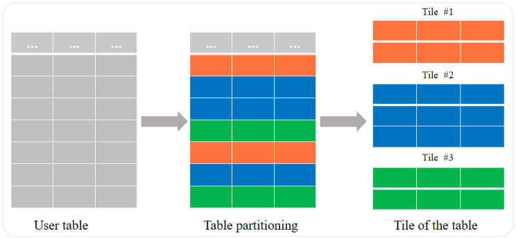
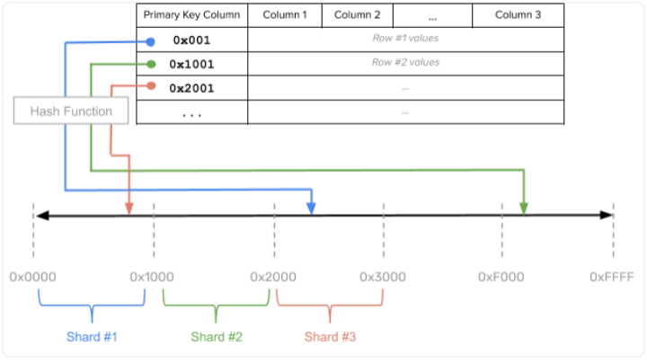
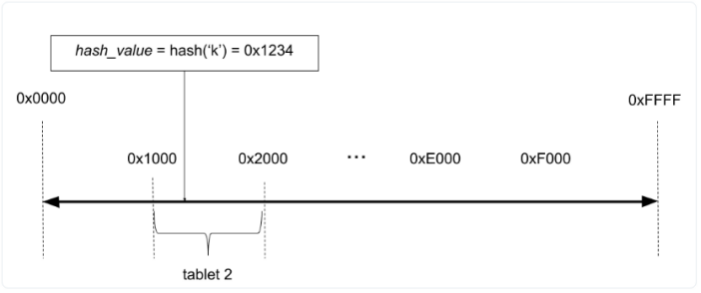
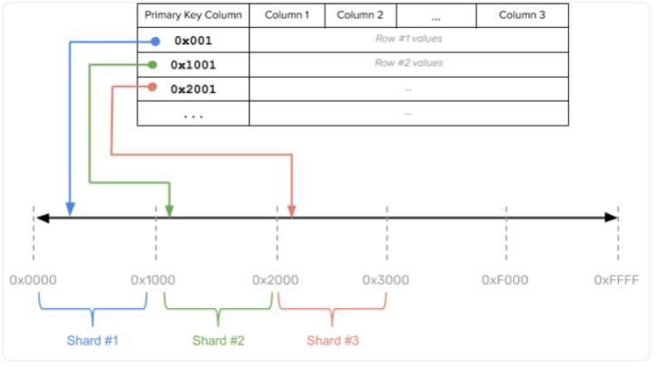

分片是将大表分解为更小的块（称为分片）的过程，这些块分布在多个服务器上。 分片也称为水平分区，分片本质上是一个水平数据分区，包含总数据集的子集，因此负责服务整体工作负载的一部分。 这个想法是将无法容纳在单个节点上的数据分布到数据库节点集群上。 水平和垂直之间的区别来自于数据库的传统表格视图。 数据库可以垂直拆分，其中不同的表列存储在单独的数据库中，也可以水平拆分，其中同一表的行存储在多个数据库节点中。

用户表由 CoreDB 作为多个分片隐式管理。 这些碎片称为Tile。 表中每一行的主键唯一地确定托管该行的tablet（也就是说，对于每个键，只有一个tablet拥有它），如下图所示：



AiSQL目前支持两种数据分片方式：哈希（也称为一致性哈希)分片和范围分片。

## **哈希分片**

通过哈希分片，数据使用分片算法均匀且随机地分布在分片上。 表的每一行都被放入一个分片中，该分片是通过计算该行的分片列值的哈希值确定的，如下图所示：



哈希分片 AiSQL 表的哈希空间是从 0x0000 到 0xFFFF 的 2 字节范围。 因此，这样的表最多可以有 64K 个Tile。 即使对于非常大的数据集或集群大小，这在实践中也应该足够了。 例如，对于具有 16 个Tile的表，整个哈希空间 [0x0000 到 0xFFFF] 被分为 16 个子范围，每个Tile一个：[0x0000, 0x1000)、[0x1000, 0x2000)、...、[0xF000, 0xFFFF]。 通过将主键转换为内部键及其哈希值来处理读取和写入操作，并确定操作应路由到哪个Tile，如下图所示：


最终用户的插入、更新、更新插入是通过将主键序列化和散列成字节序列并确定它们所属的tablet来处理的。 假设用户尝试将具有值 v 的键 k 插入表 T 中。下图演示了如何确定拥有上一个表的键的Tile：



**1.示例**
以下示例显示了使用哈希分片创建的 BSQL 表：

```
CREATE TABLE customers (
    customer_id bpchar NOT NULL,
    company_name character varying(40) NOT NULL,
    contact_name character varying(30),
    contact_title character varying(30),
    address character varying(60),
    city character varying(15),
    region character varying(15),
    postal_code character varying(10),
    country character varying(15),
    phone character varying(24),
    fax character varying(24),
    PRIMARY KEY (customer_id HASH)
);
```

以下示例显示了仅使用哈希分片创建的 BCQL 表（不需要用于设置哈希分片的显式语法）：

```
CREATE TABLE items (
    supplier_id INT,
    item_id INT,
    supplier_name TEXT STATIC,
    item_name TEXT,
    PRIMARY KEY((supplier_id), item_id)
);
```

**2.优点**
这种分片策略非常适合大规模可扩展的工作负载，因为它将数据均匀地分布在集群中的所有节点上，同时保留了向集群中添加节点的便利性。 算法哈希分片在跨节点分发数据方面也非常有效，但分发策略取决于节点数量。 通过一致的哈希分片，分片的数量远多于节点的数量，并且维护一个显式的映射表来跟踪分片到节点的分配。 添加新节点时，可以将现有节点中的分片子集有效地移至新节点，而无需重新分配大量数据。

**3.缺点**
执行范围查询可能效率低下。 此类查询的示例是查找大于下限或小于上限的行（与点查找相反）。

## **范围分片**

范围分片涉及将表的行拆分为连续的范围，这些范围遵循基于主键列值的表排序顺序。 范围分片的表通常从单个分片开始。 当数据插入到表中时，它会被动态地分割成多个分片，因为我们并不总是能够提前知道表中键的分布。 下图演示了范围分片背后的基本思想：



**1.示例**
以下示例显示了使用范围分片创建的 BSQL 表：

```
CREATE TABLE order_details (
    order_id smallint NOT NULL,
    product_id smallint NOT NULL,
    unit_price real NOT NULL,
    quantity smallint NOT NULL,
    discount real NOT NULL,
    PRIMARY KEY (order_id ASC, product_id),
    FOREIGN KEY (product_id) REFERENCES products,
    FOREIGN KEY (order_id) REFERENCES orders
);
```

BCQL表不能通过范围分片创建。 它们只能通过哈希分片创建

**2.优点**
范围分片允许通过主键值有效地查询一系列行。 此类查询的示例是查找位于下限和上限之间的所有键。

**3.缺点**
在规模上，范围分片在实践中会导致许多问题，其中一些问题与线性哈希分片类似。

首先，当从单个分片开始时意味着只有一个节点正在处理所有用户查询。 这通常会导致数据库预热问题，即使集群中有多个节点，所有查询也都由单个节点处理。 用户必须等待足够的分割发生并且这些分片重新分配才能使用集群中的所有节点，从而在生产工作负载中产生问题。 在某些情况下，可以通过将表预先分割成多个分片来提前知道键的分布，从而缓解这种情况，但这在实践中很难。

其次，跨所有分片的全局排序键通常会产生热点，一些分片的活动明显多于其他分片，并且托管这些分片的节点相对于其他节点变得过载。 虽然通过主动负载平衡可以在一定程度上缓解热点问题，但这在实践中并不总是有效，因为当热点分片在节点之间重新分配时，工作负载可能会发生变化并引入新的热点。
