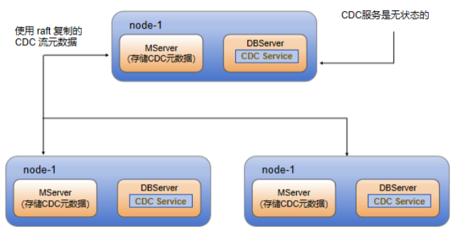

AiSQL 中的更改数据捕获 (CDC) 提供的技术可确保由于插入、更新和删除等操作而导致的任何数据更改都被识别、捕获并自动应用于另一个数据存储库实例，或者可供应用程序和应用程序使用。

## **用例**

CDC 在许多场景中都很有用。

**1.面向微服务的架构**
某些微服务需要对数据进行一系列更改，并且在 AiSQL 中使用 CDC 可以为 CDC 订阅者提供可使用的数据更改。

2.异步复制到远程系统
远程系统可以订阅数据更改流，然后转换并使用这些更改。 出于事务和报告目的维护单独的数据库实例可用于管理工作负载性能。

**3.多种数据中心策略**
维护多个数据中心使企业能够提供以下功能：

* 高可用性 (HA) — 冗余系统有助于确保您的操作几乎不会失败。
* 地理冗余——地理上分散的服务器提供了应对灾难性事件和自然灾害的弹性。

**4.合规与审计**
审核和合规性要求可能要求您使用 CDC 来维护数据更改记录。

## **流程架构**

下图描述了 CDC 流程架构

每个DBServer都有一个无状态的CDC服务。 CDC服务提供的主要API如下：

* createCDCSDKStream：用于在数据库上创建流的 API。
* getChangesCDCSDK：客户端获取最新的更改集的API。

**1.CDC 流**
创建新的 CDC 流会返回流 UUID。 这是通过 bm-admin 工具实现的。

**2.Debezium**
为了使用 CDC 生成的事件，使用 Debezium 作为连接器。 Debezium是一个开源分布式平台，需要使用流ID指向数据库。 有关如何为 AiSQL CDC 设置 Debezium 的信息，请参阅 Debezium 集成。

**3.将更改推送到外部系统**
使用 AiSQL 的 Debezium 连接器，更改从 AiSQL 推送到 Kafka 主题，然后任何最终用户应用程序都可以使用该主题来处理和分析记录。

**4.CDC保证**
CDC做出以下保证。

（1）每Tile订购的交付保证
同一Tile中一行或多行的所有数据更改均按其发生的顺序接收。 然而，由于问题的分布式性质，无法保证跨Tile的顺序。

考虑以下场景：

* 两行正在同时更新。
* 这两行属于不同的Tile。
* 第一行 row #1 在时间 t1 更新，第二行 row #2 在时间 t2 更新。
  在这种情况下，CDC 可以在推送对应于行 #1 的较早更新之前，将对应于行 #2 更改的较晚更新推送到 Kafka。

（2）至少一次交付
行的更新至少推送一次。 通过至少一次传递，您永远不会丢失消息，但是该消息可能会多次传递给 CDC 使用者。 如果Tile领导者发生变化，则可能会发生这种情况，其中旧领导者已将更改推送到 Kafka，但最新推送的操作 ID 未在 CDC 元数据中更新。

例如，CDC 客户端在时间 t1 和 t3 接收到行的更改。 客户端有可能再次收到这些更新。

（3）流中没有间隙
当您收到时间戳 t 的行的更改时，您不会收到该行较早时间戳中以前未见过的更改。 这保证了接收任何更改意味着已接收到该行的所有早期更改。