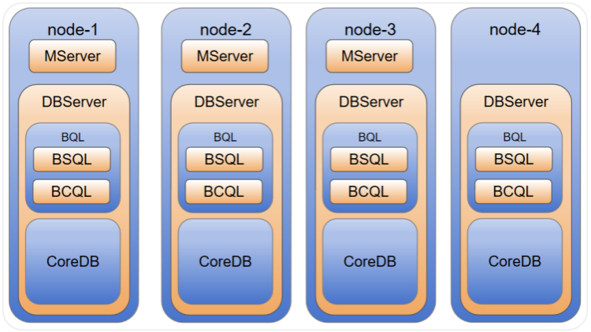

### **查询层**

AiSQL 有一个可扩展的查询层，它实现了以下 API：

* BSQL，与 PostgreSQL 线兼容的分布式 SQL API。
* BCQL 是一种为高性能和大规模而构建的半关系 API，其根源于 Cassandra 查询语言。

AiSQL 查询层（BQL）是 AiSQL 的上层。 应用程序使用客户端驱动程序直接与 BQL 交互。 该层处理特定于 API 的方面，例如查询和命令编译，以及运行时功能，例如数据类型表示、内置操作等。 BQL 的设计考虑到了可扩展性，允许添加新的 API。 目前，BQL支持两种类型的分布式SQL API：BSQL和BCQL。

如上图所示，每个 DBServer 都配置为在不同端口上支持两种类型的查询语言：端口 2521 是 BSQL 的默认端口，9542 是 BCQL 的默认端口。

从应用程序的角度来看，BQL 是无状态的，客户端可以在适当的端口上连接到一个或多个 DBServer，以对 AiSQL 集群执行操作。

每个 DBServer 内部的 BQL 实现了每个受支持的 API 所需的一些特定于 API 的方面，但最终它负责复制存储层的数据以及使用 CoreDB 检索数据，CoreDB 是 AiSQL 常见的底层强一致性分布式存储。 以下是 BQL 中每个 API 的一些子组件：

* 语句缓存，用于缓存准备好的语句的编译或执行计划，以避免与重复解析语句相关的开销。
* 命令解析器和执行层。
* 特定于语言的内置操作、数据类型编码等。
