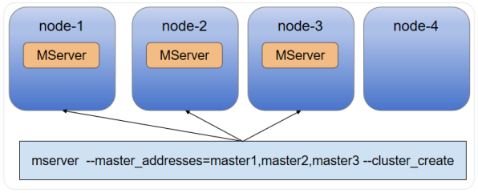
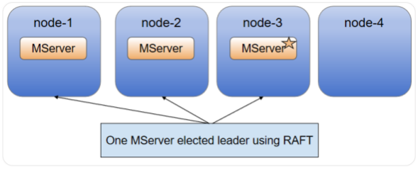
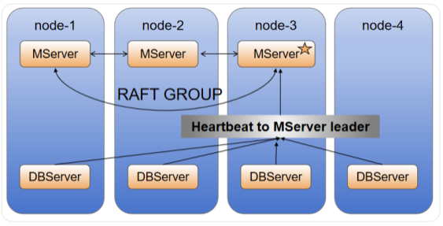
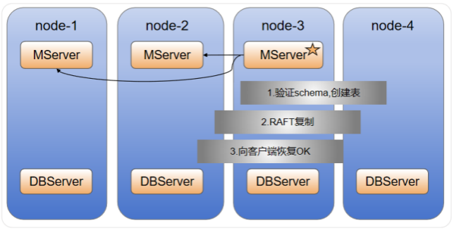
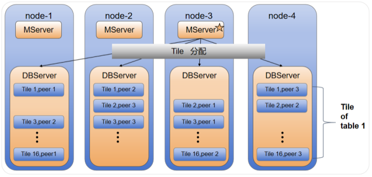
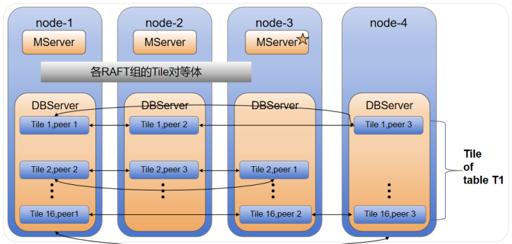
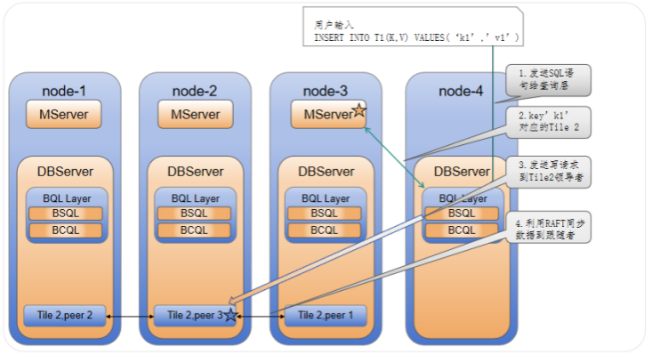

## **创建Universe**

AiSQL Universe 的创建涉及多个步骤。

1.启动MServer
创建 AiSQL Universe 时，第一步是启动足够数量的 MServer（与复制因子一样多），并且每个 MServer 都了解其他的 MServer。 这些 MServer 使用通用唯一标识符 (UUID) 进行初始化，相互了解并执行领导者选举。 在此步骤结束时，其中一位MServer将自己确立为领导者。

2.启动 DBServer
您需要启动与节点一样多的 DBServer，并在启动时将MServer地址传递给它们。 它们开始向MServer发送心跳，传达它们还活着的事实。 心跳还传达有关 DBServer 当前托管的Tile及其负载信息，但系统中尚不存在Tile。

3.示例
假设在具有四个节点的 AiSQL Universe 中创建了一个表。 另外，假设该表的复制因子为3。首先，三个MServer服务器以创建模式启动。 这样做是为了防止在创建已运行的 Universe 时出现意外错误。 下图描述了 Universe 创建过程的开始：

下图描述了MServer互相学习并选举一位leader的过程：

最后，DBServer启动，它们都向MServer发送心跳，如下图所示：

## **表创建**

在AiSQL中，用户发起的表创建由MServer领导者使用异步API处理。 一旦 MServer 领导者将表模式和执行表创建所需的所有其他信息复制到 Raft 组中的其他 MServer，以使其能够适应故障，就会返回 API 调用成功。

为了创建表，MServer 领导者执行许多步骤。

**1.验证**
MServer领导者验证表模式并为表创建所需数量的Tile。 Tile尚未分配给 DBServer。

**2.复制** 
MServer 领导者将表模式和新创建的（且尚未分配的）Tile 复制到 MServer Raft 组。 这保证了即使当前MServer Leader出现故障，建表也能成功。

**3.确认** 
此时，异步建表API返回成功，因为即使当前MServer领导者失败，操作也可以继续进行。

**4.执行**
MServer领导者将每个Tile分配给与表的复制因子一样多的DBServer。 Tile对等放置的方式确保实现所需的容错能力，并且 DBServer 相对于它们分配的Tile数量而言是均匀平衡的。 在某些部署场景中，将Tile分配给 DBServer 可能需要满足其他约束，例如跨多个云提供商、区域和可用区分布每个Tile的单独副本。

**5.持续监控** 
MServer 领导者监视整个Tile分配操作，并向用户发出的 API 调用报告其进度和完成情况。

示例
假设在具有四个节点的 AiSQL Universe 中创建了一个表。 此外，假设该表有 16 个 Tile，复制因子为 3。MServer Leader 验证架构，创建 16 个 Tile（由于复制因子为 3，总共 48 个 Tile 对等体）并复制数据，使用 Raft 在大多数 MServer 上创建表所需。 下图描述了表创建过程的开始：

下图描述了新创建的Tile被分配给多个DBServer的过程：

托管在不同 DBServer 上的Tile节点形成一个 Raft 组并选举一个领导者。 对于属于该Tile的键的所有读写，由Tile-peer领导者和Raft组分别负责。 一旦分配，Tile将归 DBServer 所有，直到所有权因长期故障或未来的负载平衡事件而被 MServer 更改，如下图所示：

如果托管 Tile Leader 的 DBServer 之一发生故障，Tile Raft 组会立即重新选举 Leader 来处理 I/O。 因此，MServer 不在关键 I/O 路径中。 如果DBServer长时间处于故障状态，MServer会找到一组合适的候选者来重新复制其数据。 它以一种节流而优雅的方式做到这一点。

 

## **写I/O路径**

写 I/O 路径可以通过单键写的示例来说明，该写操作涉及由 BQL 层处理并准备由 Tile Leader 进行复制的操作。

有关更复杂情况的信息，例如需要原子更新的多个键的分布式事务，请参阅分布式事务。

**1.BQL层的写操作处理**
用户发出的写入请求通过具有适当 API（BSQL 或 BCQL）的端口与 BQL 查询层交互。 该用户请求由 BQL 层转换为 internal key.。 如分片中所述，每个key都由一个Tile拥有。 为了确定哪个Tile拥有给定的key，BQL 层对 MServer 进行 RPC 调用。 响应被缓存以供将来使用。

AiSQL有一个智能客户端，可以直接缓存Tile的位置，因此可以节省额外的网络跃点，从而允许它直接将请求发送到托管Tile领导者的相应DBServer的BQL层。 如果BQL层发现Tile领导者托管在本地节点上，那么RPC调用就变成本地函数调用，并节省了序列化和反序列化请求，然后通过网络发送所需的时间。

然后，BQL 层将写入发送到托管Tile领导者的 DBServer。 写入由拥有key的Tile Raft 组的领导者处理。

**2.由Tile领导者准备复制操作**
下图显示了Tile领导者准备复制操作的流程：

Tile Raft 组的领导者执行以下序列：

* 验证正在执行的操作是否与当前架构兼容。
* 使用本地内存锁管理器锁定key。 请注意，追随者不存在这种锁定机制。
* 如有必要，读取数据（用于读取-修改-写入或条件更新操作）。
* 准备要写入 CoreDB 的批量更改。 这个写入批次非常接近要写入的最终一组 RocksDB 键值对，只是缺少每个键末尾的最终混合时间戳。

**3.写操作的Raft复制**
Raft复制写操作的顺序可以描述如下：

* 领导者将批处理附加到其 Raft 日志中，并为写入操作选择混合时间戳。
* 使用 Raft 将数据复制到其对等点。
* Raft 复制成功后，将数据应用到其本地 CoreDB 中。
* 成功响应用户。

follower Tile接收使用 Raft 复制的数据，并在已知数据已提交后将其应用到本地 CoreDB 中。 领导者在后续 RPC 请求中搭载提交点，如下所示：

* 包含写入批次的 Raft 条目被复制到Tile的大多数 Raft 组对等点。
* 在收到来自 Raft 子系统的“复制成功”回调后，领导者将批量写入应用到其本地 RocksDB。
* 领导者的下一次更新会通知追随者该条目已提交，并且追随者将批量写入应用到其 RocksDB 实例。

**4.回应客户**
Information pending.

**5.示例**
假设需要将值 k 和 v 插入具有键列 K 和值列 V 的表 T1 中。下图描述了写入流程：

请注意，通过假设用户应用程序将写入查询发送到随机 AiSQL 服务器，然后该服务器适当地路由请求，已经简化了前面的情况。

特别是对于 BCQL，使用 AiSQL 智能客户端可以让您避免额外的网络跃点。

 

## **读I/O路径**

读取 I/O 路径可以通过单键读取的示例来说明，该读取涉及识别随后执行读取操作的Tile领导者。

**识别Tile领导者**
用户发出的读取请求通过具有适当 API（BSQL 或 BCQL）的端口与 BQL 查询层交互。 该用户请求由 BQL 层转换为内部key，允许 BQL 层找到Tile和托管它的 DBServer。 BQL 层通过对 MServer 进行 RPC 调用来执行此操作。 响应被缓存以供将来使用。 接下来，BQL 层将读取内容发送到托管领导者 Tile 对等方的 DBServer。 读取由拥有内部key的Tile Raft 组的领导者处理。 处理读请求的Tile Raft组的领导者从其CoreDB中读取并将结果返回给用户。

如写入 I/O 路径中所述，AiSQL 智能客户端可以将应用程序请求直接路由到正确的 DBServer，从而避免任何额外的网络跃点或主查找。

**Tile领导者执行的读取操作**
假设需要从表T1中读取主键列K的值为k的值。 表T1有一个键列K和一个值列V。下图描述了读取流程：

默认是强一致性读。

读取查询可能非常复杂。 BQL查询层有一个完全优化的查询引擎来处理包含表达式、内置函数调用和算术运算的查询。

 

## **高可用**

AiSQL 是一个一致且分区容忍的数据库，同时通过拥有一个活动副本来实现非常高的可用性 (HA)，该副本准备在当前领导者发生故障后立即接管作为新的领导者并服务请求。

如果某个节点发生故障，则会导致其上运行的服务器中断。 它们将是 DBServer 和 MServer（如果在该节点上运行）。

**1.DBServer故障**
DBServer 托管 BQL 层和Tile，其中一些Tile是主动提供 I/O 服务的Tile对等领导者，而其他Tile是复制数据的Tile对等追随者，并且是其相应领导者的活动备用设备。

每个 BQL 层、Tile Peer Followers 和 Tile Peer Leader 的故障均以特定方式处理。

（1）BQL失败
从应用程序的角度来看，BQL 是无状态的。 因此，发出请求的客户端只需将请求发送到不同节点上的 BQL。 对于智能客户端，它们基于key搜索理想的 DBServer 位置，然后将请求直接发送到该节点。

（2）Tile对等追随者故障
Tile同行追随者并不处于关键路径上。 它们的故障不会影响用户请求的可用性。

（3）Tile对等领导者失败
任何 Tile Peer Leader 的故障都会在几秒钟内自动触发新的 Raft 级 Leader 选举，并且不同 DBServer 上的另一个 Tile Peer 会取代它成为新的 Leader。 如果Tile对等领导者发生故障，不可用窗口约为3秒（假设默认心跳间隔为500毫秒）。

**2.MServer故障**
MServer 不在正常 I/O 操作的关键路径中，因此它的故障不会影响正常运行的 Universe。 尽管如此，MServer 是 Raft 组的一部分，其对等点运行在不同的节点上。 这些对等点之一是活动主服务器，其他对等点是活动备用服务器。 如果活动主节点（MServer 领导者）发生故障，这些对等点会检测到领导者故障并重新选举新的 MServer 领导者，该新 MServer 领导者会在故障发生后的几秒内成为活动主节点。
