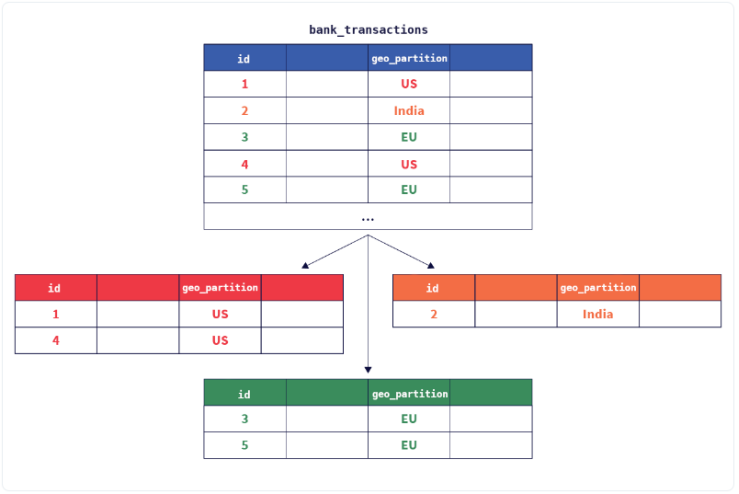
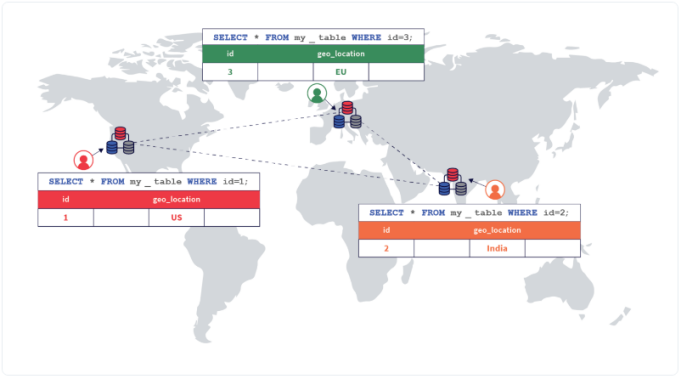
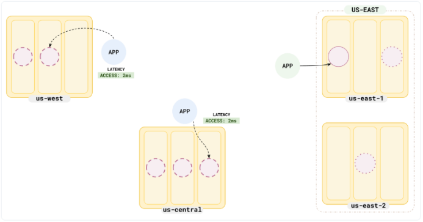
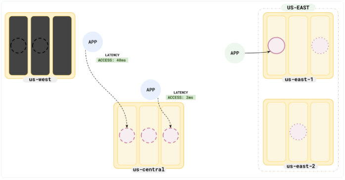

BMDB 支持一组丰富的多区域部署拓扑。 本节介绍其中一些部署。 主要部署包括：

* 跨区域同步复制：默认
* 地理分区：根据策略将数据固定到不同的地理位置
* xDCR：用于单向和双向异步复制
* 读副本：使用异步复制为不同区域提供读取服务

下表总结了 BMDB 中的这些不同的多区域部署及其一些关键特征。

|                | 默认               | 地理分区                           | xDCR                                         | 读取副本                                                 |
| -------------- | ------------------ | ---------------------------------- | -------------------------------------------- | -------------------------------------------------------- |
| 复制方式       | 同步               | 同步                               | 异步（单向/双向）                            | 异步（单向）                                             |
| 数据驻留       | 所有数据跨区域复制 | 数据跨区域分区。分区在区域内复制。 | 所有数据都在区域内复制，配置每表跨区域复制。 | 所有数据都复制在主区域中。集群范围内的异步复制到只读副本 |
| 一致性         | 事务一致性         | 事务一致性                         | 时间线一致性                                 | 时间线一致性                                             |
| 写延迟         | 高延迟             | 低延迟                             | 低延迟                                       | N/A                                                      |
| 读延迟         | 高延迟             | 低延迟（当从附近的地理位置查询时） | 低延迟                                       | 低延迟                                                   |
| Schema changes | 透明管理           | 透明管理                           | 手动操作                                     | 透明管理                                                 |
| RPO            | 无数据丢失         | 无数据丢失（可能部分不可用）       | 部分数据丢失                                 | 无数据丢失                                               |

 

## **3区域部署（节点之间数据同步复制）**

为了在整个云区域发生故障时提供保护，您可以通过同步复制的多区域universe跨多个区域部署 BMDB。 在同步的多区域 Universe 中，跨三个区域至少复制三个节点，复制因子 (RF) 为 3。如果某个区域发生故障，Universe 会继续为来自其余区域的数据请求提供服务。 BMDB 自动执行到其他两个区域中的节点的故障转移，并且被故障转移的Tile均匀分布在其余两个区域中。

这种部署具有以下优点：

* 弹性 - 将universe节点放在不同的区域可以提供更高程度的故障独立性。
* 一致性 - 所有写入都会同步复制。 事务是全球一致的。

 

## **行级数据地理分布**

将数据固定到区域以实现合规性并降低延迟

行级地理分区允许对用户表中的数据（每行级）固定到地理位置进行细粒度控制，从而允许在表行级管理数据驻留。 需要低延迟多区域部署、事务一致性语义和跨区域透明模式更改传播的用例将受益于此功能。

地理分区允许您将数据移至更靠近用户的位置：

* 实现更低的延迟和更高的性能
* 满足数据驻留要求，以遵守 GDPR 等法规

数据的地理分区可以对表数据在不同地理位置的放置进行细粒度的行级控制。 这是通过两个步骤完成的：

* 将表划分为用户定义的表分区。
* 通过为每个分区配置元数据，将这些分区固定到所需的地理位置。

要创建用户定义的表分区，请将表的一列指定为将用于对数据进行地理分区的分区列。 给定行的该列的值用于确定该行所属的表分区。

**第二步**涉及使用表空间在各个地理位置创建分区。 请注意，每个分区中的数据可以配置为跨云提供商区域中的多个可用区（zone）、跨多个附近区域（region）或数据中心进行复制。

通过添加新的表分区并将其配置为将数据驻留在所需的地理位置，可以动态引入全新的地理分区。 通过删除必要的分区，可以有效地清除一个或多个现有地理位置中的数据。 传统 RDBMS 的用户会认为这种方案接近用户定义的基于列表的表分区，并且能够控制每个分区的地理位置。

在此部署中，用户可以低延迟地访问其数据，因为数据驻留在地理位置较近的服务器上，并且查询不需要访问遥远地理位置的数据。

本教程在下一节中描述的示例场景的上下文中解释了此功能。

示例场景
假设一家虚构的大型银行 Bigmath Bank 想要为许多国家的用户提供在线银行服务，处理他们的存款、取款和转账。

构建这样的服务需要以下属性：

* 具有高可用性的事务语义：数据的一致性在银行应用程序中至关重要，因此数据库应该符合 ACID。 此外，用户希望服务始终可用，这使得高可用性和故障恢复能力成为关键要求。
* 高性能：在线交易需要低延迟处理，以确保良好的最终用户体验。 这要求特定用户的数据位于附近的地理区域。 将所有数据放在 RDBMS 中的单个位置意味着远离该位置的用户的请求将具有非常高的延迟，从而导致糟糕的用户体验。
* 合规性的数据驻留要求：许多国家/地区都有关于可以存储其居民个人数据的地理区域的规定，并且作为个人数据的银行交易必须遵守这些要求。 例如，GDPR 有一项数据驻留规定，实际上要求欧盟境内个人的个人数据存储在欧盟。 同样，印度储备银行（简称 RBI）发布了一项要求，强制要求所有银行、中介机构和其他第三方在印度存储与支付数据有关的所有信息 - 尽管在国际交易中， 交易国外部分的数据可以存储在国外位置。

注：虽然此场景具有法规遵从性要求，即数据需要驻留在某些地理位置，但完全相同的技术也适用于将数据移近用户以实现低延迟和高性能的目标。 因此，上面列出了高性能作为要求。

**1.创建表空间**
首先，为您希望将数据分区到的每个地理区域创建表空间：

```
CREATE TABLESPACE eu_central_1_tablespace WITH (
  replica_placement='{"num_replicas": 3, "placement_blocks":
  [{"cloud":"aws","region":"eu-central-1","zone":"eu-central-1a","min_num_replicas":1},
  {"cloud":"aws","region":"eu-central-1","zone":"eu-central-1b","min_num_replicas":1},
  {"cloud":"aws","region":"eu-central-1","zone":"eu-central-1c","min_num_replicas":1}]}'
);
 
CREATE TABLESPACE us_west_2_tablespace WITH (
  replica_placement='{"num_replicas": 3, "placement_blocks":
  [{"cloud":"aws","region":"us-west-2","zone":"us-west-2a","min_num_replicas":1},
  {"cloud":"aws","region":"us-west-2","zone":"us-west-2b","min_num_replicas":1},
  {"cloud":"aws","region":"us-west-2","zone":"us-west-2c","min_num_replicas":1}]}'
);
 
CREATE TABLESPACE ap_south_1_tablespace WITH (
  replica_placement='{"num_replicas": 3, "placement_blocks":
  [{"cloud":"aws","region":"ap-south-1","zone":"ap-south-1a","min_num_replicas":1},
  {"cloud":"aws","region":"ap-south-1","zone":"ap-south-1b","min_num_replicas":1},
  {"cloud":"aws","region":"ap-south-1","zone":"ap-south-1c","min_num_replicas":1}]}'
);
```

要查看您的表空间，您可以输入以下命令：

```
SELECT * FROM pg_tablespace;
```

**2.创建带分区的表**
接下来，创建包含 geo_partition 列的父表，该列用于为要将数据分区到的每个地理区域创建基于列表的分区，如下图所示：

（1）创建父表

```
CREATE TABLE bank_transactions (
    user_id   INTEGER NOT NULL,
    account_id INTEGER NOT NULL,
    geo_partition VARCHAR,
    account_type VARCHAR NOT NULL,
    amount NUMERIC NOT NULL,
    txn_type VARCHAR NOT NULL,
    created_at TIMESTAMP DEFAULT NOW()
) PARTITION BY LIST (geo_partition);
```

注：您可以将 geo_partition 设置为 DEFAULT bm_server_region() 以基于区域进行分区。 这样，对本地分区表的插入不必指定 geo_partition 列值。

（2）接下来，在父表下为每个所需的地理位置创建一个分区，并将每个分区分配给适用的表空间。 在这里，您创建三个表分区：一个用于欧盟区域，称为bank_transactions_eu，另一个用于印度区域，称为bank_transactions_india，第三个分区用于美国区域，称为bank_transactions_us。 为每个分区创建任何所需的索引，确保将每个索引与分区表的表空间关联。

```
CREATE TABLE bank_transactions_eu
    PARTITION OF bank_transactions
      (user_id, account_id, geo_partition, account_type,
      amount, txn_type, created_at,
      PRIMARY KEY (user_id HASH, account_id, geo_partition))
    FOR VALUES IN ('EU') TABLESPACE eu_central_1_tablespace;
 
CREATE INDEX ON bank_transactions_eu(account_id) TABLESPACE eu_central_1_tablespace;
 
CREATE TABLE bank_transactions_india
    PARTITION OF bank_transactions
      (user_id, account_id, geo_partition, account_type,
      amount, txn_type, created_at,
      PRIMARY KEY (user_id HASH, account_id, geo_partition))
    FOR VALUES IN ('India') TABLESPACE ap_south_1_tablespace;
 
CREATE INDEX ON bank_transactions_india(account_id) TABLESPACE ap_south_1_tablespace;
 
CREATE TABLE bank_transactions_us
    PARTITION OF bank_transactions
      (user_id, account_id, geo_partition, account_type,
      amount, txn_type, created_at,
      PRIMARY KEY (user_id HASH, account_id, geo_partition))
    FOR VALUES IN ('US') TABLESPACE us_west_2_tablespace;
 
CREATE INDEX ON bank_transactions_us(account_id) TABLESPACE us_west_2_tablespace;
```

（3）使用 \d 元命令查看迄今为止创建的表和分区。

```
bigmath=# \d
                List of relations
 Schema |         Name          | Type |  Owner
-----------+-----------------------------------+-------+----------
 public  | bank_transactions         | table | bigmath
 public  | bank_transactions_eu      | table | bigmath
 public  | bank_transactions_india    | table | bigmath
 public  | bank_transactions_us      | table | bigmath
(4 rows)
```

现将数据整理如下：

区域-本地事务表
当您使用具有放置集的表空间创建表时，BMDB 会自动在表空间下创建一个事务表（如果尚不存在），其名称类似于 system.transactions_90141438-f42c-4a39-8a12-4072c1216d46。

3.固定特定于地理位置的用户分区
现在，设置应该能够根据 geo_partition 列中设置的值自动将行固定到适当的区域。 如下图所示：

您可以通过插入几行数据并验证它们是否写入正确的分区来测试此区域固定。

扩展输出显示
示例输出包括扩展的自动模式输出格式，以提高可读性。 您可以使用以下语句启用此模式：

```
bigmath=# \x auto
Expanded display is used automatically.
```

（1）在下面的表中插入一行，其中 geo_partition 列值设置为 EU。

```
INSERT INTO bank_transactions
    VALUES (100, 10001, 'EU', 'checking', 120.50, 'debit');
```

（2）验证该行是否存在于bank_transactions 表中。

```
bigmath=# select * from bank_transactions;
 
-[ RECORD 1 ]-+---------------------------
user_id       | 100
account_id    | 10001
geo_partition | EU
account_type  | checking
amount        | 120.5
txn_type      | debit
created_at    | 2020-11-07 21:28:11.056236
```

此外，该行必须仅存在于bank_transactions_eu分区中，可以通过直接针对该分区运行select语句来轻松验证这一点。 其他分区不应包含任何行。

```
bigmath=# select * from bank_transactions_eu;
-[ RECORD 1 ]-+---------------------------
user_id       | 100
account_id    | 10001
geo_partition | EU
account_type  | checking
amount        | 120.5
txn_type      | debit
created_at    | 2020-11-07 21:28:11.056236
bigmath=# select count(*) from bank_transactions_india;
 count
-------
     0
bigmath=# select count(*) from bank_transactions_us;
 count
-------
     0
```

将数据插入其他分区。

```
INSERT INTO bank_transactions
    VALUES (200, 20001, 'India', 'savings', 1000, 'credit');
INSERT INTO bank_transactions
    VALUES (300, 30001, 'US', 'checking', 105.25, 'debit');
```

这些可以验证如下：

```
bigmath=# select * from bank_transactions_india;
-[ RECORD 1 ]-+---------------------------
user_id       | 200
account_id    | 20001
geo_partition | India
account_type  | savings
amount        | 1000
txn_type      | credit
created_at    | 2020-11-07 21:45:26.011636
bigmath=# select * from bank_transactions_us;
-[ RECORD 1 ]-+---------------------------
user_id       | 300
account_id    | 30001
geo_partition | US
account_type  | checking
amount        | 105.25
txn_type      | debit
created_at    | 2020-11-07 21:45:26.067444
```

**4.查询本地分区**
可以通过在分区键上使用 WHERE 子句来完成对特定分区的查询。 例如，如果客户端位于美国，则可以通过运行以下查询来查询本地分区：

```
bigmath=# select * from bank_transactions where geo_partition='US';
-[ RECORD 1 ]-+---------------------------
user_id       | 300
account_id    | 30001
geo_partition | US
account_type  | checking
amount        | 105.25
txn_type      | debit
created_at    | 2020-11-07 21:45:26.067444
```

但是，如果需要查询本地分区而不指定分区列，可以使用函数 bm_is_local_table。 要使用 bm_is_local_table 实现与上面相同的查询，您可以执行以下操作：

```
bigmath=# select * from bank_transactions where bm_is_local_table(tableoid);
-[ RECORD 1 ]-+---------------------------
user_id       | 300
account_id    | 30001
geo_partition | US
account_type  | checking
amount        | 105.25
txn_type      | debit
created_at    | 2020-11-07 21:45:26.067444
```

5.跨地理位置旅行的用户
更有趣的是，用户 100 的第一笔银行交易是在欧盟地区进行的，他前往印度和美国，并进行了另外两笔银行交易。 这可以通过使用以下语句来模拟：

```
INSERT INTO bank_transactions
    VALUES (100, 10001, 'India', 'savings', 2000, 'credit');
INSERT INTO bank_transactions
    VALUES (100, 10001, 'US', 'checking', 105, 'debit');
```

现在，每笔银行交易都将被固定到适当的地理位置。 这可以如下验证。

```
bigmath=# select * from bank_transactions_india where user_id=100;
-[ RECORD 1 ]-+---------------------------
user_id       | 100
account_id    | 10001
geo_partition | India
account_type  | savings
amount        | 2000
txn_type      | credit
created_at    | 2020-11-07 21:56:26.760253
bigmath=# select * from bank_transactions_us where user_id=100;
-[ RECORD 1 ]-+---------------------------
user_id       | 100
account_id    | 10001
geo_partition | US
account_type  | checking
amount        | 105
txn_type      | debit
created_at    | 2020-11-07 21:56:26.794173
```

可以使用以下 SQL 语句检索用户进行的所有银行交易。

```
bigmath=# select * from bank_transactions where user_id=100 order by created_at desc;
-[ RECORD 1 ]-+---------------------------
user_id       | 100
account_id    | 10001
geo_partition | US
account_type  | checking
amount        | 105
txn_type      | debit
created_at    | 2020-11-07 21:56:26.794173
-[ RECORD 2 ]-+---------------------------
user_id       | 100
account_id    | 10001
geo_partition | India
account_type  | savings
amount        | 2000
txn_type      | credit
created_at    | 2020-11-07 21:56:26.760253
-[ RECORD 3 ]-+---------------------------
user_id       | 100
account_id    | 10001
geo_partition | EU
account_type  | checking
amount        | 120.5
txn_type      | debit
created_at    | 2020-11-07 21:28:11.056236
```

**6.添加新的地理位置**
假设一段时间后，Bigmath Bank 在全球范围内获得了大量客户，并希望向也有数据居住法的巴西居民提供服务。 使用行级地理分区，您可以通过添加新分区并将其固定到 AWS 南美洲（圣保罗）区域 sa-east-1 来实现此目的。

首先，创建表空间：

```
CREATE TABLESPACE sa_east_1_tablespace WITH (
    replica_placement='{"num_replicas": 3, "placement_blocks":
      [{"cloud":"aws","region":"sa-east-1","zone":"sa-east-1a","min_num_replicas":1},
      {"cloud":"aws","region":"sa-east-1","zone":"sa-east-1b","min_num_replicas":1},
      {"cloud":"aws","region":"sa-east-1","zone":"sa-east-1c","min_num_replicas":1}]}'
    );
```

然后，为巴西创建分区：

```
CREATE TABLE bank_transactions_brazil
    PARTITION OF bank_transactions
      (user_id, account_id, geo_partition, account_type,
       amount, txn_type, created_at,
       PRIMARY KEY (user_id HASH, account_id, geo_partition))
    FOR VALUES IN ('Brazil') TABLESPACE sa_east_1_tablespace;
```

至此，新区域已准备好存储巴西居民的银行交易。

```
INSERT INTO bank_transactions
    VALUES (400, 40001, 'Brazil', 'savings', 1000, 'credit');
select * from bank_transactions_brazil;
-[ RECORD 1 ]-+-------------------------
user_id       | 400
account_id    | 40001
geo_partition | Brazil
account_type  | savings
amount        | 1000
txn_type      | credit
created_at    | 2020-11-07 22:09:04.8537
```

**7.区域中断期间的容错**
到目前为止，您已经设置了 3 个数据副本的复制，这有助于容忍单个节点或区域的丢失。 但是，区域中断会导致不可用，因为所有节点都在一个区域内。 将每个副本放置在不同的区域有助于解决此问题。

重新创建之前的 us_west_2_表空间，并在 us-west2、us-west1 和 us-east1 中各放置一个副本。 然后使用leader_preference继续将所有领导者放置在us-west-2中，以便他们保持靠近客户端并提供最佳性能。 （您可以在领导者偏好中找到更多信息）

```
CREATE TABLESPACE us_west_2_tablespace WITH (
  replica_placement='{"num_replicas": 3, "placement_blocks":
  [{"cloud":"aws","region":"us-west-2","zone":"us-west-2a","min_num_replicas":1,"leader_preference":1},
  {"cloud":"aws","region":"us-west-1","zone":"us-west-1a","min_num_replicas":1,"leader_preference":2},
  {"cloud":"aws","region":"us-east-1","zone":"us-east-1a","min_num_replicas":1}]}'
);
```

 

## **xDCR (2个区域异步复制)**

单向（主从）和双向（多主）复制
默认情况下，BMDB 提供跨地理分布式数据中心的同步复制和强一致性。 然而，许多用例不需要同步复制，也不需要证明与管理三个或更多数据中心相关的额外复杂性和运营成本是合理的。 跨集群 (xDCR) 部署提供跨两个数据中心或云区域的异步复制。

本练习使用两个本地 BMDB 集群模拟地理分布式双数据中心 (2DC) 部署，一个代表“Data Center - East”，另一个代表“Data Center - West”。

有关详细信息，请参阅以下内容：
xDCR复制架构
xDCR 复制命令
变更数据捕获 (CDC)

**1.创建两个数据中心**
创建两个数据中心如下：
（1）通过从 BMDB 主目录运行以下命令来创建并启动模拟“Data Center - East”的本地集群：

```
./bin/bm-ctl start \
                --advertise_address=127.0.0.1 \
                --base_dir=/tmp/bmd1
```

这将使用 IP 地址 127.0.0.1 启动单节点本地集群，并创建 /tmp/bmd1 作为基目录。

（2）如果您在 macOS 上运行并且尚未创建任何loopback地址，请按如下方式配置一个：

```
sudo ifconfig lo0 alias 127.0.0.2
```

（3）通过运行以下命令创建并启动模拟“Data Center - West”的第二个本地集群：

```
./bin/bm-ctl start \
                --advertise_address=127.0.0.2 \
                --base_dir=/tmp/bmd2
```

这将使用 IP 地址 127.0.0.2 启动单节点集群，并创建 /tmp/bmd2 作为基目录。

**2.创建表**
在默认的 bigmath 数据库中，您可以在“Data Center - East”集群上创建表 users：
（1）通过指定主机IP地址127.0.0.1打开sqlsh，如下：

```
./bin/sqlsh -h 127.0.0.1
```


（2）创建表users，如下：

```
CREATE TABLE users (
    email varchar PRIMARY KEY,
    username varchar
    );
```

在第二个集群上创建一个相同的表：
（1）打开“Data Center - West”的sqlsh，指定主机IP地址127.0.0.2，如下：

```
./bin/sqlsh -h 127.0.0.2
```

（2）创建表users，如下：

```
CREATE TABLE users (
    email varchar PRIMARY KEY,
    username varchar
    );
```

集群上有两个相同的表允许您跨两个数据中心设置 xDCR 复制。

**3.配置单向复制**
要将“Data Center - West”配置为“Data Center - East”集群中数据更改的目标，您需要使用 bm-admin 实用程序 setup_universe_replication 命令。 语法如下：

```
bm-admin -master_addresses <target-master-addresses> \
    setup_universe_replication <source-universe_uuid> \
    <source_master_addresses> <source-table-ids>
```

* target-master-addresses：目标 MServer 服务器的逗号分隔列表。 对于此模拟，您有一台用于目标的 MServer 服务器，127.0.0.2:11000。
* source-universe-uuid：源集群的唯一标识符。 在源MServer UI（http://127.0.0.1:10000）中查找UUID。
* source-master-addresses：以逗号分隔的源 MServer 服务器列表。 对于此模拟，您有一台 MServer 服务器作为源，127.0.0.1:11000。
* source-table-ids：以逗号分隔的表 UUID 列表。 对于此模拟，用户表； 在MServer UI（http://127.0.0.1:10000/tables）中查找UUID。

根据从 MServer UI 获取的实际值，从 BMDB 主目录运行 bm-admin setup_universe_replication 命令，类似于以下示例中所示的命令：

```
./bin/bm-admin -master_addresses 127.0.0.2:11000 \
    setup_universe_replication 7acd6399-657d-42dc-a90a-646869898c2d \
    127.0.0.1:11000 000033e8000030008000000000004000
```

target-master-addresses: 127.0.0.2:11000
source-universe-uuid: 7acd6399-657d-42dc-a90a-646869898c2d
source-master-addresses: 127.0.0.1:11000
source-table-ids: 000033e8000030008000000000004000

您应该看到以下消息：

```
Replication setup successfully
```

**4.验证单向复制**
要检查复制，您可以将数据添加到一个集群上的用户表中，并查看数据出现在第二个集群上的用户表中。

（1）使用以下命令将数据添加到“Data Center - East”集群，确保您指向新的源主机：

```
./bin/sqlsh -h 127.0.0.1
INSERT INTO users(email, username) VALUES ('hector@example.com', 'hector'), ('steve@example.com', 'steve');
```

（2）在目标“Data Center - West”集群上，执行以下命令，可以看到集群间数据已复制：

```
./bin/sqlsh -h 127.0.0.2
SELECT * FROM users;
```

输出如下：

```
        email         | username
---------------------+----------
  hector@example.com  | hector
  steve@example.com   | steve
(2 rows)
```

**5.配置双向复制**
双向 xDCR 复制允许您将数据插入任一集群上的同一个表中，并将数据更改添加到另一个集群中。

要为同一表配置双向复制，请运行 bm-admin setup_universe_replication 命令以使“Data Center - East”集群成为“Data Center - West”集群的目标。 这次，目标是127.0.0.1:11000，源是127.0.0.2:11000。

在源 MServer UI (http://127.0.0.2:10000) 中查找源 UUID，在 http://127.0.0.2:10000/tables 中查找源表 UUID。

根据从 MServer UI 获取的实际值，运行 bm-admin setup_universe_replication 命令，类似于以下示例中所示的命令：

```
./bin/bm-admin -master_addresses 127.0.0.1:11000 \
    setup_universe_replication 0a315687-e9bd-430f-b6f4-ac831193a394 \
    127.0.0.2:11000 000030a9000030008000000000004000
```

* target-master-addresses: 127.0.0.1:11000
* source-universe-uuid: 0a315687-e9bd-430f-b6f4-ac831193a394
* source-master-addresses: 127.0.0.2:11000
* source-table-ids: 000030a9000030008000000000004000

您应该看到以下消息：

```
Replication setup successfully
```

**6.验证双向复制**
配置双向复制后，您可以将数据添加到“Data Center - West”集群上的用户表中，并看到数据出现在“Data Center - East”集群上的用户表中。

（1）使用以下命令将数据添加到“Data Center - West”集群，确保您指向新的源主机：

```
./bin/sqlsh -h 127.0.0.2
INSERT INTO users(email, username) VALUES ('neha@example.com', 'neha'), ('mikhail@example.com', 'mikhail');
```

（2）在新的目标集群上，运行以下命令可以看到集群之间的数据已复制：

```
./bin/sqlsh -h 127.0.0.1
SELECT * FROM users;
```

您应该看到以下输出：

```
        email         | username
---------------------+----------
  hector@example.com  | hector
  steve@example.com   | steve
  neha@example.com    | neha
  mikhail@example.com | mikhail
(4 rows)
```

**7.添加表**
您可以使用 bm-admin 命令 alter_universe_replication add_table 将更多表添加到现有复制：

```
bm-admin -master_addresses <target-master-addresses> \
        alter_universe_replication <source-universe_uuid> \
        add_table <source-table-ids>
```

以下是一个示例命令：

```
./bin/bm-admin -master_addresses 127.0.0.2:11000 \
    alter_universe_replication 7acd6399-657d-42dc-a90a-646869898c2d \
    add_table 000030a9000030008000000000004000
```

有关详细信息，请参阅 alter_universe_replication。


## **读副本**

将数据异步复制到一个或多个只读副本集群。

### **BSQL**

在其他区域运行的应用程序会因读取领导者的最新数据而产生跨区域延迟。 如果对于在其他区域中运行的应用程序来说，读取的一点陈旧性是可以接受的，那么只读副本就是要采用的模式。

只读副本集群是连接到主集群的一组从属节点。 这些纯粹是观察者节点，这意味着它们不参与 Raft 共识和选举。 因此，只读副本可以具有与主集群不同的复制因子 (RF)，并且您可以拥有偶数个副本。

让我们看看这对您的应用程序有何好处。

**1.设置**
假设您在 us-east-1 和 us-east-2 中设置了一个 RF 3 集群，并将领导者首选项设置为 us-east-1。 假设您想在美国中部和美国西部运行其他应用程序。 读取延迟类似于下图。

**2.改善读取延迟**
为了改善读取延迟，请在您要运行应用程序且可以接受一点陈旧情况的每个区域中设置单独的只读副本集群。

这使得应用程序能够从最近的副本读取数据，而不是跨区域到Tile领导者。

请注意，us-west 中应用程序的读取延迟已从最初的 60 毫秒大幅降至 2 毫秒，us-central 中应用程序的读取延迟也已降至 2 毫秒。

由于副本可能并非所有更新都是最新的，根据设计，这可能会返回稍微陈旧的数据（默认值为 30 秒，但可以配置）。

这仅用于读取。 所有写入仍然发送给领导者。

**3.故障转移**
当某个区域中的只读副本发生故障时，应用程序会将其读取重定向到下一个最近的只读副本或领导者。

请注意，当 us-west 中的只读副本失败时，us-west 中的应用程序如何从 us-central 中的follower读取数据。 在这种情况下，读取延迟为 40 ms，仍然比原来的 60 ms 小很多。

**4.了解更多**
读取副本架构
追随者阅读

