通过向集群添加节点来处理更大的工作负载。
在BMDB中，数据被分割（分片）为多个Tile，这些多个Tile被放置在各个节点上。 当添加更多节点时，一些Tile会自动重新平衡到新节点。 Tile可以根据需要动态分割以使用新添加的资源，这导致每个节点管理更少的Tile。 因此，整个集群可以并行处理更多事务和查询，从而提高处理更大工作负载的能力。

您可以添加更多节点来分发Tile，也可以增加节点的规格来有效、可靠地扩展您的universe，以处理以下任务：

* 每秒高交易量
* 大量并发客户端连接
* 大型数据集
* 多个地区和大洲的数据

**水平扩展**（scale out）
水平扩展，也称为scale out，是向分布式数据库添加更多节点以处理增加的负载和数据的过程。 水平扩展是BMDB中最常见的扩展模型，具有多个优点，包括：

* 提高性能 - 更多节点可以并行处理请求，从而减少响应时间。
* 成本效益 - 您可以使用商用硬件，通常比高端服务器便宜。
* 弹性扩展 - 您可以根据需要添加新节点以适应增长或临时横向扩展以处理特殊事件（例如黑色星期五购物或重大新闻爆发）的高流量。 事件发生后，您可以通过排出某些节点（或 Kubernetes Pod）中的所有数据并将它们从 Universe 中删除来减小集群的大小（缩减）。

**垂直缩放（scale up）**
垂直扩展涉及升级集群中每个节点的现有硬件或资源。 您无需添加更多机器，而是通过增加 CPU、内存、存储等来增强单台机器的功能。 垂直扩展通常受到单个服务器容量的限制，并且当您转向更强大的硬件时可能会变得昂贵。 尽管保留相同数量的节点可以简化操作，但最终硬件资源会达到极限，进一步扩展可能不可行。

在某些情况下，根据您的应用程序需求和预算限制，可以结合使用水平和垂直扩展来实现所需的性能和可扩展性目标。
**水平缩放与垂直缩放**
下表列出了 BMDB 集群水平和垂直扩展的优缺点。

|            | 水平扩展                                                 | 垂直扩展                                                |
| ---------- | -------------------------------------------------------- | ------------------------------------------------------- |
| 节点数量   | 增加                                                     | 保持不变                                                |
| 易操作性   | 添加新节点到集群                                         | 添加更强大的节点，耗尽旧节点，并将旧节点从集群中删除    |
| 容错能力   | 随着更多节点的添加而增加                                 | 保持不变                                                |
| 集群再平衡 | 快                                                       | 慢                                                      |
| 未来扩展性 | 可以添加更多节点                                         | 仅限于当前可用的最强大的机器                            |
| 增加成本   | 新机器的成本                                             | 新旧机器成本差异                                        |
| 磁盘       | 可以使用与其他节点相同的磁盘作为数据，并且连接将被分布式 | 除了 CPU 和内存之外，磁盘也应该升级以处理增加的工作负载 |

**增强功能**
CoreDB 是 BMDB 的底层分布式文档存储， 它经过彻底设计，可大规模提供高性能。 CoreDB 中内置了多项功能来增强性能，包括：

* Scan-resistant全局块缓存
* Bloom/索引数据拆分
* 全局内存存储限制
* 单独的压缩队列以减少读放大
* 跨磁盘智能负载平衡

 

## **分片和再平衡（Sharding and Rebalancing）**

跨节点无缝地将表拆分为Tile
水平扩展是 BMDB 的一流功能。 该数据库被设计为在添加节点时无缝水平扩展。 数据透明地移动到新节点，不会造成任何服务中断。

BMDB 将表数据存储在 Tile 中。 分片是将表数据分割并分布到Tile中的过程。 水平可扩展性需要透明的数据分片。

下面说明了分片的工作原理。

### **初始集群设置**

假设您有一个复制因子 (RF) 为 3 的 3 节点集群，并且您将存储一个以整数作为主键的基本表。 数据存储在单个Tile中（例如 T1）。 该表从一个具有高可用性的 Tile 开始，其中包含一个 Tile 领导者（节点 2）和两个追随者（节点 1 和节点 3 上的副本）。
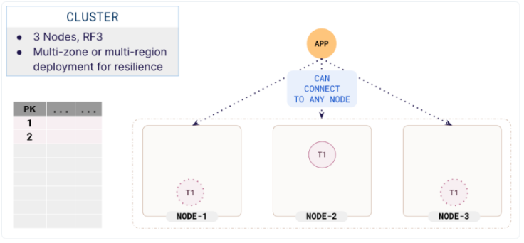
### **添加更多数据**

当您向表中添加更多数据时，Tile T1 的领导者和追随者开始增长。
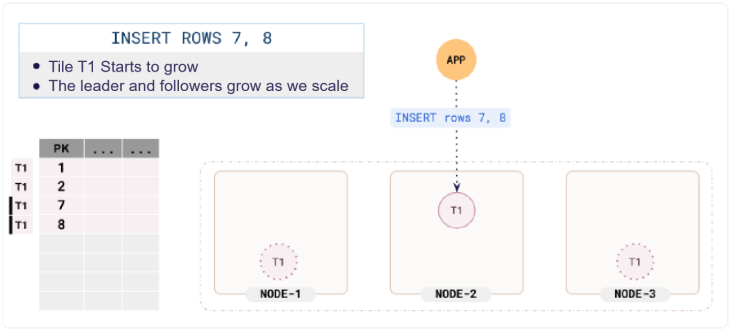
### **Tile分裂**

一旦Tile达到阈值大小（在本例中假设为 4 行），Tile T1 将通过创建新Tile T2 分成两部分。 Tile的分裂几乎是瞬时的，并且对应用程序是透明的。 新创建的Tile将有领导者和追随者。
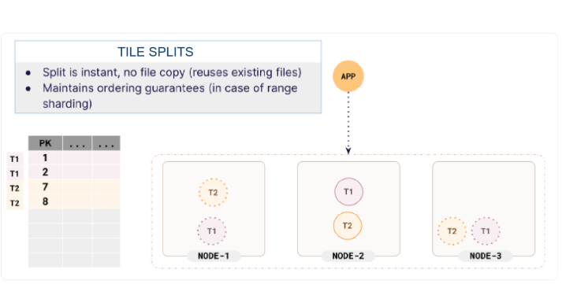
### **再平衡**

在上图中，T1 和 T2 位于同一节点 (node-2)。 BMDB 意识到领导者不平衡，并自动将领导者分布在不同的节点上。 这可确保集群得到最佳使用。
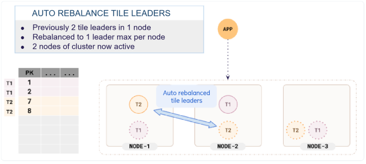重新平衡也适用于追随者，而不仅仅是领导者。

### **完全横向扩展**

随着更多数据添加到表中，Tile会进一步分裂并根据需要重新平衡。 添加更多数据后，您将得到类似于下图的分布：
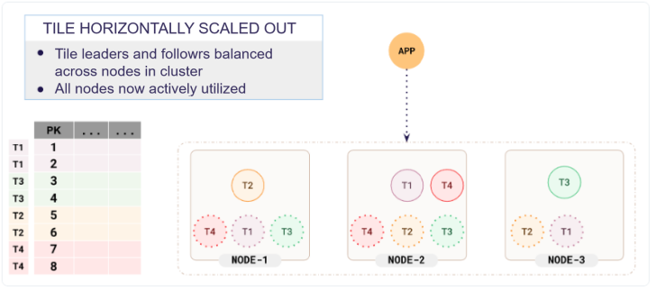

## **节点扩容**

通过添加新节点进行横向扩展，按需无缝扩展集群
在 BMDB 中，您可以通过添加新节点来按需水平扩展集群，而不会中断您的应用程序。

### **初始设置**

假设您有一个包含 4 个Tile且复制因子 (RF) 为 3 的 3 节点集群。您注意到集群不平衡，一个节点获得更多流量，并决定向集群添加另一个节点。
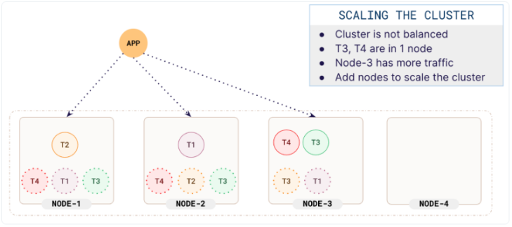
### **复制**

添加节点后，Tile将重新平衡。 该过程首先在新节点中为Tile添加一个额外的副本，然后新Tile从Tile领导者引导其数据。 在此过程中，吞吐量不会受到影响，因为数据引导是异步的。

### **更换领导者**

新的副本完全引导后，会触发该Tile的领导者选举，并提示让新添加的节点中的副本成为领导者。 这次领导者切换非常快。
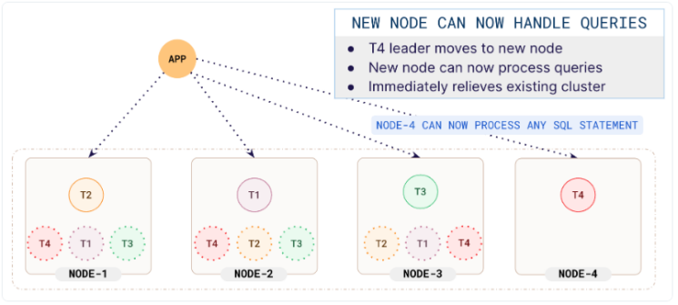现在节点4有了Tile leader，它就可以主动承担负载，从而减少其他节点的负载。

### **修复过度复制**

添加新节点时，会创建 Tile T4 的新副本。 现在T4有4个副本，虽然集群是RF3。 通过删除其他副本之一可以修复这种过度复制。
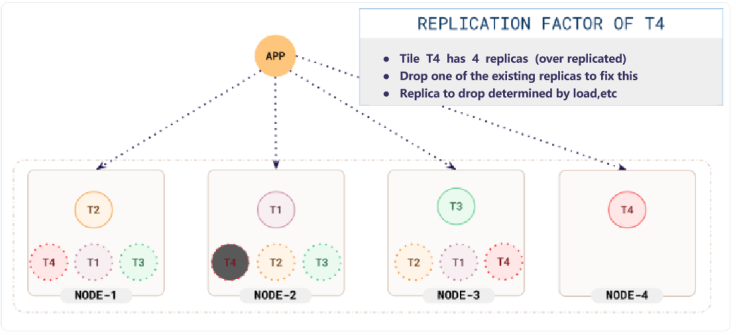
### **重新平衡追随者**

现在领导者已经转移到新节点并且过度复制已经得到解决，追随者也被重新均匀地分布在集群中。
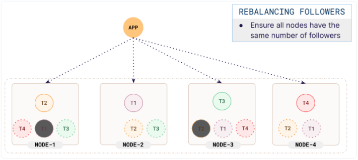
### **完全横向扩展的集群**

重新平衡完成后，您应该看到集群中领导者和追随者的合理分布，如下所示：
集群现已完全横向扩展。

### **负载均衡**

现在您已成功添加节点并扩展集群，应用程序可以连接到任何节点并发送查询。 但是您的应用程序如何知道新节点呢？ 为此，您可以在应用程序中使用 BMDB 智能驱动程序。 当新添加的节点处于活动状态时，智能驱动程序会自动将流量发送到它们。 尽管您可以使用外部负载平衡器，但智能驱动程序具有拓扑感知能力，并且会在需要时正确进行故障转移。
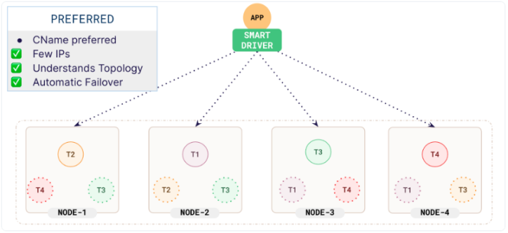

## **Scaling reads**

通过添加更多节点来水平扩展读取。
随着更多节点添加到集群中，BMDB 中的读取呈线性扩展。

### **读取数据如何运作**

当连接到节点的应用程序发送对键的读取请求时，例如 SELECT * FROM T WHERE K=5，BMDB 首先识别包含指定键 (K=5) 的行的 Tile Leader 的位置。 识别出数据块领导者的位置后，请求将在内部重定向到包含所请求key的数据块领导者的节点。 领导者掌握最新数据并立即响应。

基本 select 语句最多仅涉及 2 个节点。 这种重定向对于应用程序来说是完全透明的。
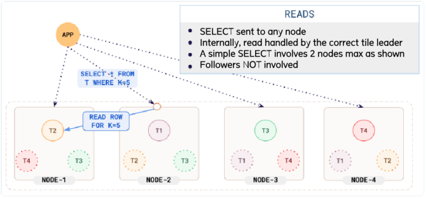
多个应用程序可以连接到任何节点，并且读取将被正确重定向。

### **Sysbench下的工作负载展示**

下面显示了如何使用基本配置选项的 sysbench 工作负载在 BMDB 中水平扩展读取。 该集群由 m6i.4xlarge 实例组成，拥有 1024 个连接。 所有请求的延迟均小于 3 毫秒。
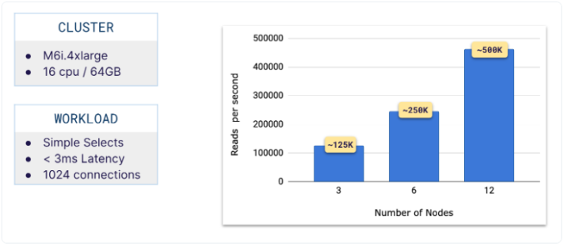您可以清楚地看到，随着节点数量的增加，读取数量呈线性缩放。

 

## **Scaling writes**

当您添加更多节点时，在 BMDB 中写入能力会水平扩展。
随着更多节点添加到集群中，在 BMDB 中写入性能线性增长。

### **写作如何工作**

当连接到节点的应用程序发送对键的写入请求时，例如 UPDATE T SET V=2 WHERE K=5，BMDB 首先识别包含指定键 (K=5) 的行的 Tile Leader 的位置。 识别出数据块领导者的位置后，请求将在内部重定向到包含所请求key的数据块领导者的节点。

领导者将写入复制给追随者，然后将写入确认返回应用程序。 复制到追随者会增加请求的额外延迟。

基本写入最多只涉及 2 个节点。
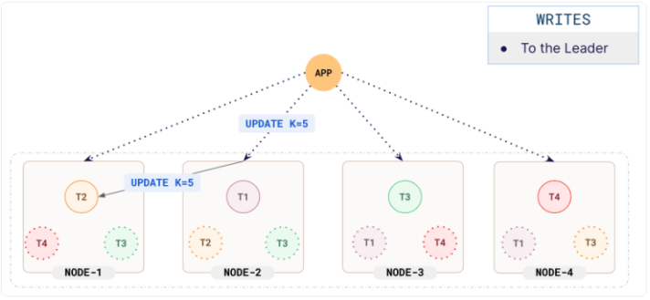
如果必须提取多行并且位于不同的Tile中，则从位于不同节点的各个Tile内部获取各个行。 这种重定向对于应用程序来说是完全透明的。 
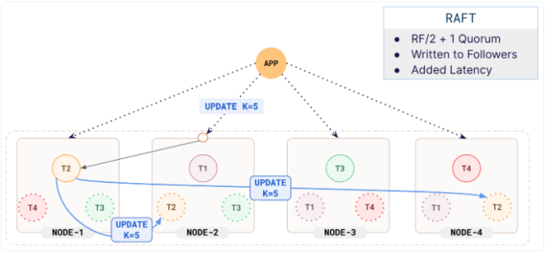
### **Sysbench下的工作负载展示**

下面显示了如何使用基本配置选项的 Sysbench 工作负载在 BMDB 中水平扩展写入。 该集群由 m6i.4xlarge 实例组成，拥有 1024 个连接。 所有请求的延迟均小于 10 毫秒。
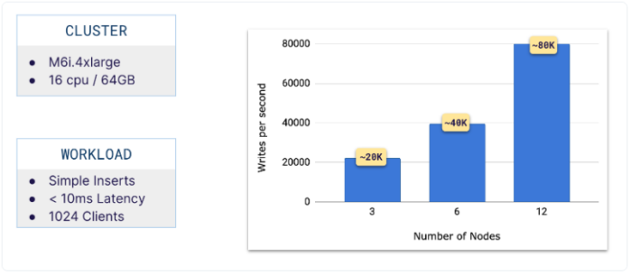您可以清楚地看到，随着节点数量的增加，写入数量呈线性增长。

 

## **Scaling transactions**

横向扩展时的事务性能。
事务是一组预期以原子方式执行的 SQL 语句。 让事务正常工作涉及多个组件。

用最简单的解释来说，客户端连接的节点充当事务管理器。 节点获取必要的锁，与领导者对话以获取事务中涉及的key，将事务提交给领导者，最后复制到各自的追随者。
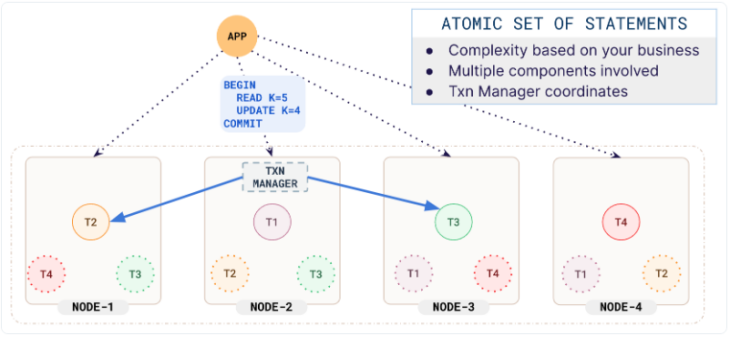
### **OLTP 基准**

事务处理系统基准（TPC-C）是衡量数据库事务处理能力的黄金标准。 它模拟批发零件供应商的订单输入。 它包括多种交易类型，其中包括：

* 输入和交付订单
* 记录付款
* 检查订单状态
* 监控库存水平
  性能指标衡量每分钟可以处理的新订单数量，并以每分钟交易数 (TPM-C) 表示。 该基准旨在通过增加仓库数量来模拟业务扩张。

### **TPC-C 结果**

下面显示了使用以下配置的 TPC-C 基准测试的结果：

* BMDB 版本 2.20.1
* AWS，美国西部区域，c5d.9xlarge 实例
* 复制因子3

**100K仓库**
100K 基准测试在具有 59 个节点的 Universe 上运行。

| 效率  | TPMC       | 平均新订单延迟(MS) | BSQL 操作数/秒 | CPU使用率％ |
| ----- | ---------- | ------------------ | -------------- | ----------- |
| 99.83 | 1283804.18 | 51.86              | 348602.48      | 58.22       |

BMDB 仅用 59 个节点，以 99.83% 的效率轻松处理 100K 仓库，每分钟处理 130 万个事务。

**150K仓库**
100K 基准测试在扩展到 75 个节点的universe上运行。

| 效率 | TPMC | 平均新订单延迟(MS) | BSQL 操作数/秒 | CPU使用率％ |
| ---- | ---- | ------------------ | -------------- | ----------- |
| 99.3 | 1M   | 123.33             | 950K           | 80          |

测试执行期间的延迟和IOPS如下图所示。
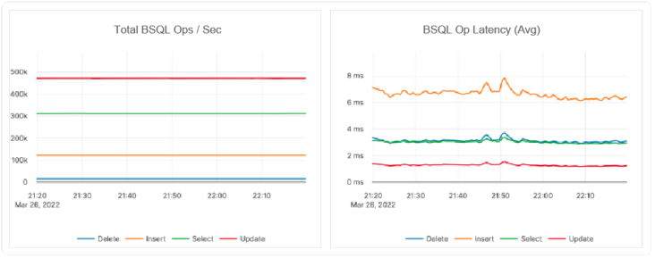

## **Large datasets**

横向扩展时运行大型数据集的性能
随着时间序列指标和 IoT 传感器事件等数据工作负载的不断增长，数据库需要处理大数据（大于 10 TB）。 从成本效益的角度来看，运行每个节点都存储 TB 级数据的高密度数据库集群非常有意义。 但是，启动新的数据节点以获得更多的每个节点存储会导致昂贵的计算资源的严重浪费。

BMDB 专为处理大数据而设计，并由激进的复制和存储架构提供支持。 与最终一致的 Cassandra 兼容数据库相比，在 BMDB 中引导新节点和删除现有节点更加简单且更具弹性。

以下场景展示了 BMDB 如何在四台通用机器上处理总计 18 TB 的数据.

### **配置和数据大小**

集群节点数量：4
节点配置：c4.4xlarge (16-vcpus, 30 GB RAM, 1 x 6000 TB gp2 EBS SSD)
复制因子：3
KV记录数：200亿条
键 + 值大小：~300 字节
Key大小：50 字节
值大小：256 字节（故意选择不太可压缩）
逻辑数据集大小： 200 亿个keys * 300 字节 = 6000 GB
包含复制的原始数据：6000 GB * 3 = 18 TB
每个节点的数据：18TB / 4 = 4.5 TB

### **数据加载**

使用 “Cassandra Key Value” 示例应用程序在大约 6 天内以稳定的速率加载数据。 下图显示了每个节点的 SSTable 大小在 6 天内稳定增长，超过该值后稳定在 4.5 TB。
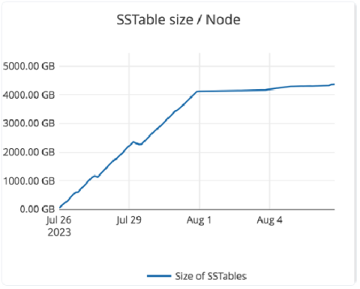
下图显示了 MServer 管理 UI，其中包含Tile服务器、每个服务器上的Tile数量、Tile领导者数量以及磁盘上 SSTable 文件的大小 (4.5 TB)。
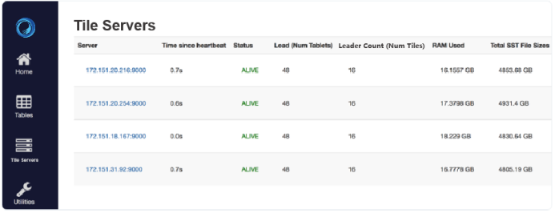
### **Read-heavy workload**

在具有 32 个读取器和 2 个写入器的读取密集型工作负载中，BMDB 提供了 19K ops/s 的服务，延迟为 1.35 毫秒。
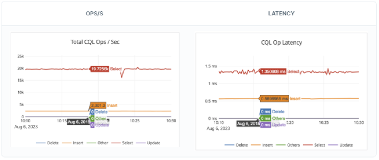请注意，这是一个随机读取工作负载，每个节点仅需要 30GB RAM 即可存储 4.5TB 数据。 因此，每次读取都将被迫转到磁盘，并且此工作负载受到 EBS 卷可以支持的 IO 的瓶颈。

正如预期的那样，CPU 不是此工作负载的瓶颈，CPU 使用率低于 7%

### **Write-heavy workload**

在具有 2 个读取器和 64 个写入器的写入密集型工作负载上，BMDB 提供 25K 操作/秒服务，延迟为 4 毫秒。
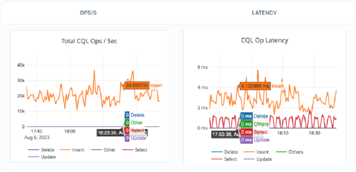
对于写入密集型工作负载，由于使用通用 SSD (gp2) EBS 卷，因此存在更多变化。 这种可变性是由于需要执行定期压实而产生的。 请注意，对于 IoT 或类似 KairosDB 的工作负载等时间序列数据，BMDB 不需要执行激进的压缩，结果会更好。 但这个特定的实验正在运行任意 KV 工作负载，并且正如预期的那样对系统提出了更高的要求。

使用 2x3000GB EBS 卷可能是获得更高吞吐量的更好选择，而不是每个节点使用 1x6000GB EBS 卷。 当磁盘 R + W 吞吐量在压缩期间达到最大值（大约 150MB/秒）时，延迟也会增加一点。

为了在低端 gp2 SSD 基于卷的设置上为前台操作留出足够的空间，我们将压缩/刷新速率的默认配额设置从 100MB/秒减少到 30MB/秒。

在直接连接 NVMe SSD 的 i3* 实例类型（具有更高的磁盘 IOPS 和吞吐量）上，对于类似的工作负载，观察到的这种变化应该很小。

 

## **Scale out a universe**

BMDB 中的水平扩展和缩减

BMDB 可以在运行读写工作负载时无缝扩展。 您可以通过对复制因子为 3 的三节点 Universe 使用 BM 工作负载模拟器应用程序并在工作负载运行时添加一个节点来查看这一点。 使用内置指标，您可以通过验证读取和写入 IOPS 数量始终均匀分布在所有节点上来观察Universe如何扩展。
